# 爱心宠物领养平台 - UML模型图（续）

## 8. 状态图 (State Diagram)

### 8.1 宠物状态图

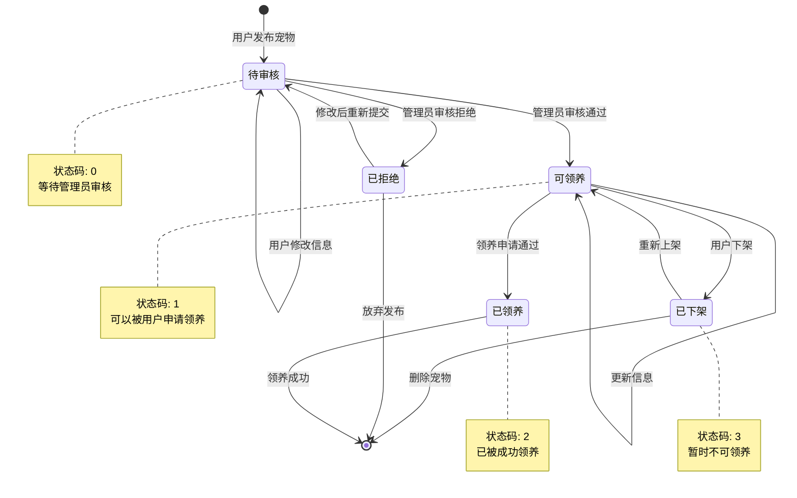
```mermaid
stateDiagram-v2
    [*] --> 待审核: 用户发布宠物
    
    待审核 --> 可领养: 管理员审核通过
    待审核 --> 已拒绝: 管理员审核拒绝
    待审核 --> 待审核: 用户修改信息
    
    可领养 --> 已领养: 领养申请通过
    可领养 --> 已下架: 用户下架
    可领养 --> 可领养: 更新信息
    
    已下架 --> 可领养: 重新上架
    已下架 --> [*]: 删除宠物
    
    已拒绝 --> 待审核: 修改后重新提交
    已拒绝 --> [*]: 放弃发布
    
    已领养 --> [*]: 领养成功
    
    note right of 待审核
        状态码: 0
        等待管理员审核
    end note
    
    note right of 可领养
        状态码: 1
        可以被用户申请领养
    end note
    
    note right of 已领养
        状态码: 2
        已被成功领养
    end note
    
    note right of 已下架
        状态码: 3
        暂时不可领养
    end note
```

### 8.2 领养申请状态图

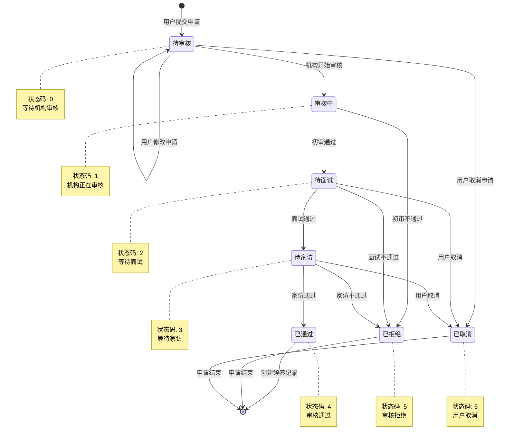
```mermaid
stateDiagram-v2
    [*] --> 待审核: 用户提交申请
    
    待审核 --> 审核中: 机构开始审核
    待审核 --> 已取消: 用户取消申请
    待审核 --> 待审核: 用户修改申请
    
    审核中 --> 待面试: 初审通过
    审核中 --> 已拒绝: 初审不通过
    
    待面试 --> 待家访: 面试通过
    待面试 --> 已拒绝: 面试不通过
    待面试 --> 已取消: 用户取消
    
    待家访 --> 已通过: 家访通过
    待家访 --> 已拒绝: 家访不通过
    待家访 --> 已取消: 用户取消
    
    已通过 --> [*]: 创建领养记录
    已拒绝 --> [*]: 申请结束
    已取消 --> [*]: 申请结束
    
    note right of 待审核
        状态码: 0
        等待机构审核
    end note
    
    note right of 审核中
        状态码: 1
        机构正在审核
    end note
    
    note right of 待面试
        状态码: 2
        等待面试
    end note
    
    note right of 待家访
        状态码: 3
        等待家访
    end note
    
    note right of 已通过
        状态码: 4
        审核通过
    end note
    
    note right of 已拒绝
        状态码: 5
        审核拒绝
    end note
    
    note right of 已取消
        状态码: 6
        用户取消
    end note
```

### 8.3 机构认证状态图

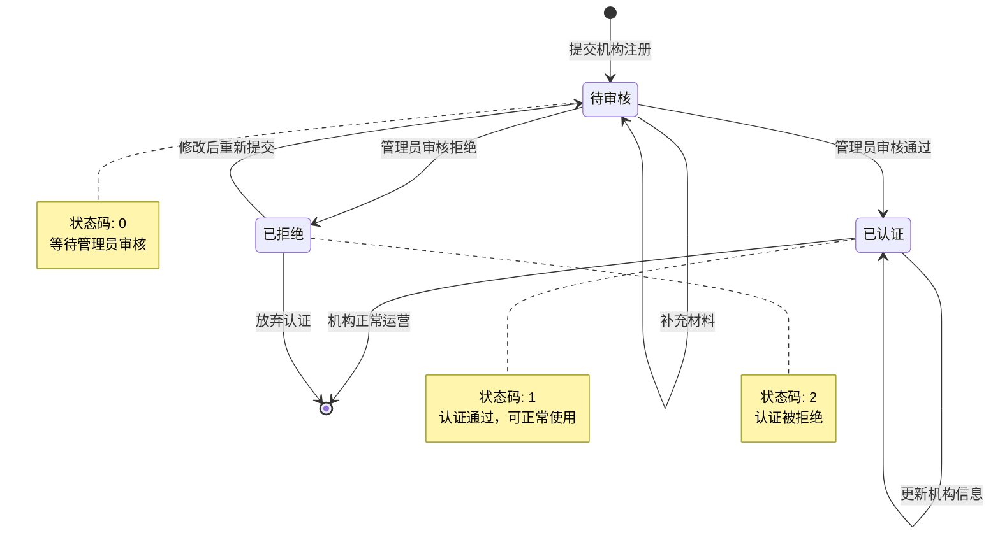
```mermaid
stateDiagram-v2
    [*] --> 待审核: 提交机构注册
    
    待审核 --> 已认证: 管理员审核通过
    待审核 --> 已拒绝: 管理员审核拒绝
    待审核 --> 待审核: 补充材料
    
    已认证 --> 已认证: 更新机构信息
    已认证 --> [*]: 机构正常运营
    
    已拒绝 --> 待审核: 修改后重新提交
    已拒绝 --> [*]: 放弃认证
    
    note right of 待审核
        状态码: 0
        等待管理员审核
    end note
    
    note right of 已认证
        状态码: 1
        认证通过，可正常使用
    end note
    
    note right of 已拒绝
        状态码: 2
        认证被拒绝
    end note
```

### 8.4 捐赠状态图

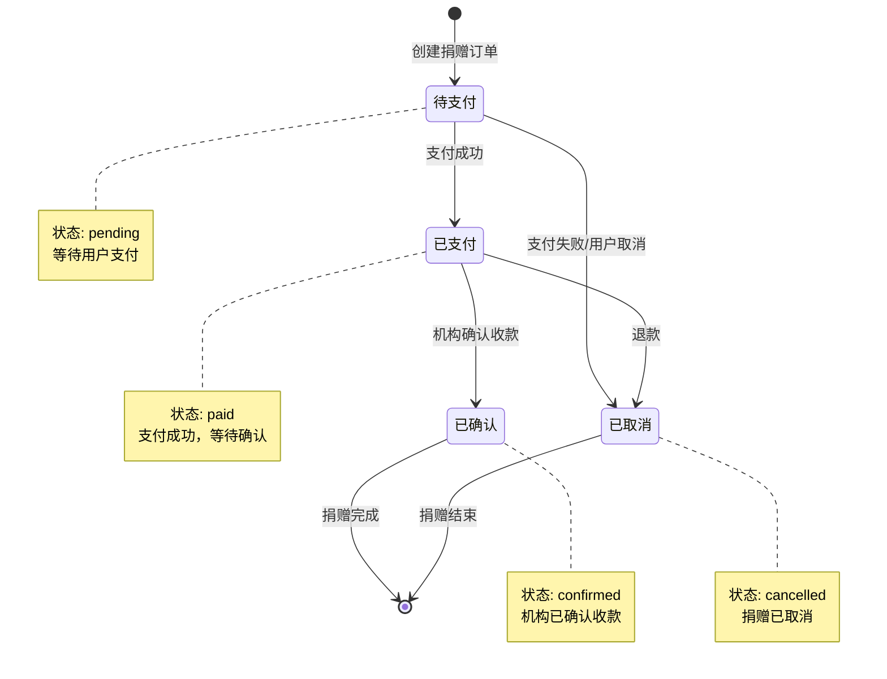
```mermaid
stateDiagram-v2
    [*] --> 待支付: 创建捐赠订单
    
    待支付 --> 已支付: 支付成功
    待支付 --> 已取消: 支付失败/用户取消
    
    已支付 --> 已确认: 机构确认收款
    已支付 --> 已取消: 退款
    
    已确认 --> [*]: 捐赠完成
    已取消 --> [*]: 捐赠结束
    
    note right of 待支付
        状态: pending
        等待用户支付
    end note
    
    note right of 已支付
        状态: paid
        支付成功，等待确认
    end note
    
    note right of 已确认
        状态: confirmed
        机构已确认收款
    end note
    
    note right of 已取消
        状态: cancelled
        捐赠已取消
    end note
```

### 8.5 动态发布状态图

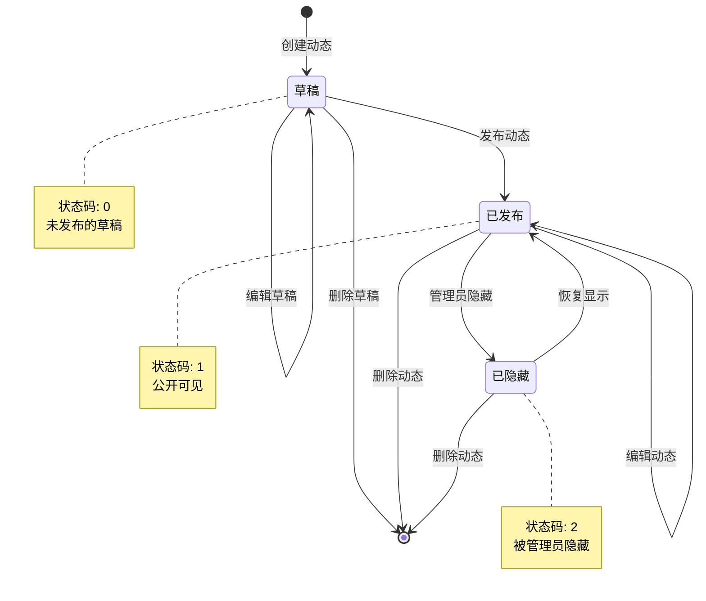
```mermaid
stateDiagram-v2
    [*] --> 草稿: 创建动态
    
    草稿 --> 已发布: 发布动态
    草稿 --> [*]: 删除草稿
    草稿 --> 草稿: 编辑草稿
    
    已发布 --> 已隐藏: 管理员隐藏
    已发布 --> 已发布: 编辑动态
    已发布 --> [*]: 删除动态
    
    已隐藏 --> 已发布: 恢复显示
    已隐藏 --> [*]: 删除动态
    
    note right of 草稿
        状态码: 0
        未发布的草稿
    end note
    
    note right of 已发布
        状态码: 1
        公开可见
    end note
    
    note right of 已隐藏
        状态码: 2
        被管理员隐藏
    end note
```

## 9. 活动图 (Activity Diagram)

### 9.1 用户注册活动图

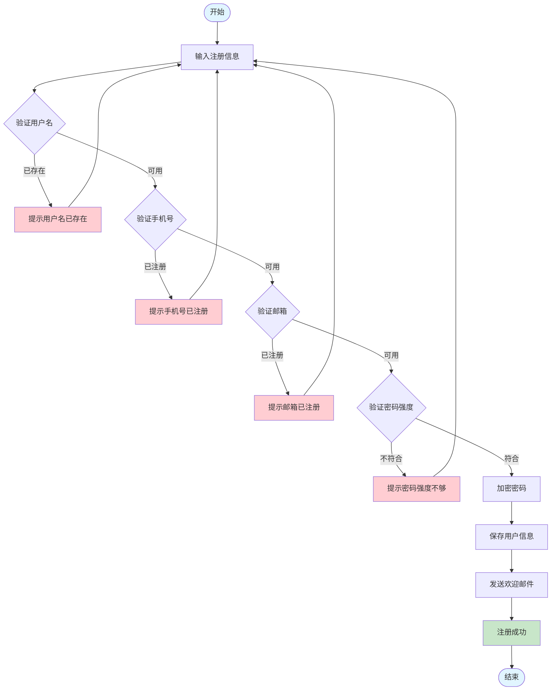
```mermaid
flowchart TD
    Start([开始]) --> Input[输入注册信息]
    Input --> ValidateUsername{验证用户名}
    ValidateUsername -->|已存在| ErrorUsername[提示用户名已存在]
    ErrorUsername --> Input
    
    ValidateUsername -->|可用| ValidatePhone{验证手机号}
    ValidatePhone -->|已注册| ErrorPhone[提示手机号已注册]
    ErrorPhone --> Input
    
    ValidatePhone -->|可用| ValidateEmail{验证邮箱}
    ValidateEmail -->|已注册| ErrorEmail[提示邮箱已注册]
    ErrorEmail --> Input
    
    ValidateEmail -->|可用| ValidatePassword{验证密码强度}
    ValidatePassword -->|不符合| ErrorPassword[提示密码强度不够]
    ErrorPassword --> Input
    
    ValidatePassword -->|符合| EncryptPassword[加密密码]
    EncryptPassword --> SaveUser[保存用户信息]
    SaveUser --> SendWelcome[发送欢迎邮件]
    SendWelcome --> Success[注册成功]
    Success --> End([结束])
    
    style Start fill:#e1f5ff
    style End fill:#e1f5ff
    style Success fill:#c8e6c9
    style ErrorUsername fill:#ffcdd2
    style ErrorPhone fill:#ffcdd2
    style ErrorEmail fill:#ffcdd2
    style ErrorPassword fill:#ffcdd2
```

### 9.2 宠物发布活动图

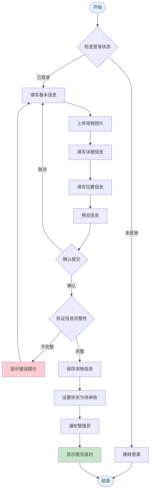
```mermaid
flowchart TD
    Start([开始]) --> CheckLogin{检查登录状态}
    CheckLogin -->|未登录| Login[跳转登录]
    Login --> End([结束])
    
    CheckLogin -->|已登录| FillBasic[填写基本信息]
    FillBasic --> UploadPhoto[上传宠物照片]
    UploadPhoto --> FillDetail[填写详细信息]
    FillDetail --> FillLocation[填写位置信息]
    FillLocation --> Preview[预览信息]
    
    Preview --> Confirm{确认提交}
    Confirm -->|取消| FillBasic
    
    Confirm -->|确认| ValidateInfo{验证信息完整性}
    ValidateInfo -->|不完整| ShowError[显示错误提示]
    ShowError --> FillBasic
    
    ValidateInfo -->|完整| SavePet[保存宠物信息]
    SavePet --> SetPending[设置状态为待审核]
    SetPending --> NotifyAdmin[通知管理员]
    NotifyAdmin --> ShowSuccess[显示提交成功]
    ShowSuccess --> End
    
    style Start fill:#e1f5ff
    style End fill:#e1f5ff
    style ShowSuccess fill:#c8e6c9
    style ShowError fill:#ffcdd2
```

### 9.3 领养申请活动图

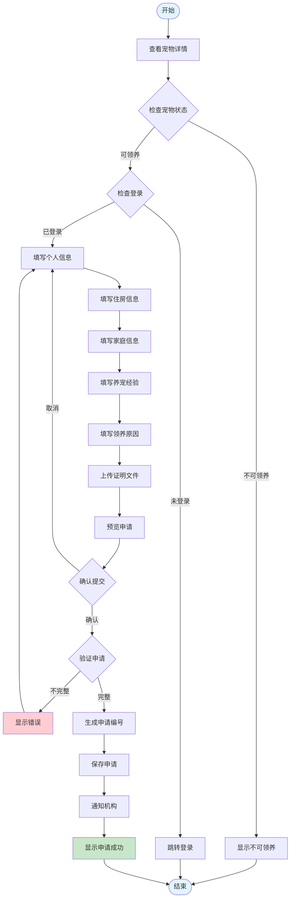
```mermaid
flowchart TD
    Start([开始]) --> ViewPet[查看宠物详情]
    ViewPet --> CheckStatus{检查宠物状态}
    CheckStatus -->|不可领养| ShowUnavailable[显示不可领养]
    ShowUnavailable --> End([结束])
    
    CheckStatus -->|可领养| CheckLogin{检查登录}
    CheckLogin -->|未登录| Login[跳转登录]
    Login --> End
    
    CheckLogin -->|已登录| FillPersonal[填写个人信息]
    FillPersonal --> FillHousing[填写住房信息]
    FillHousing --> FillFamily[填写家庭信息]
    FillFamily --> FillExperience[填写养宠经验]
    FillExperience --> FillReason[填写领养原因]
    FillReason --> UploadDoc[上传证明文件]
    UploadDoc --> Preview[预览申请]
    
    Preview --> Confirm{确认提交}
    Confirm -->|取消| FillPersonal
    
    Confirm -->|确认| ValidateApp{验证申请}
    ValidateApp -->|不完整| ShowError[显示错误]
    ShowError --> FillPersonal
    
    ValidateApp -->|完整| GenerateNo[生成申请编号]
    GenerateNo --> SaveApp[保存申请]
    SaveApp --> NotifyOrg[通知机构]
    NotifyOrg --> ShowSuccess[显示申请成功]
    ShowSuccess --> End
    
    style Start fill:#e1f5ff
    style End fill:#e1f5ff
    style ShowSuccess fill:#c8e6c9
    style ShowError fill:#ffcdd2
```

### 9.4 机构审核领养申请活动图

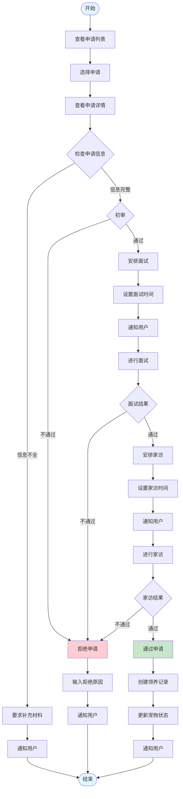
```mermaid
flowchart TD
    Start([开始]) --> ViewApp[查看申请列表]
    ViewApp --> SelectApp[选择申请]
    SelectApp --> ViewDetail[查看申请详情]
    ViewDetail --> CheckInfo{检查申请信息}
    
    CheckInfo -->|信息不全| RequestMore[要求补充材料]
    RequestMore --> NotifyUser1[通知用户]
    NotifyUser1 --> End([结束])
    
    CheckInfo -->|信息完整| InitialReview{初审}
    InitialReview -->|不通过| RejectApp[拒绝申请]
    RejectApp --> InputReason[输入拒绝原因]
    InputReason --> NotifyUser2[通知用户]
    NotifyUser2 --> End
    
    InitialReview -->|通过| ArrangeInterview[安排面试]
    ArrangeInterview --> SetInterviewTime[设置面试时间]
    SetInterviewTime --> NotifyUser3[通知用户]
    NotifyUser3 --> ConductInterview[进行面试]
    
    ConductInterview --> InterviewResult{面试结果}
    InterviewResult -->|不通过| RejectApp
    
    InterviewResult -->|通过| ArrangeHomeVisit[安排家访]
    ArrangeHomeVisit --> SetHomeVisitTime[设置家访时间]
    SetHomeVisitTime --> NotifyUser4[通知用户]
    NotifyUser4 --> ConductHomeVisit[进行家访]
    
    ConductHomeVisit --> HomeVisitResult{家访结果}
    HomeVisitResult -->|不通过| RejectApp
    
    HomeVisitResult -->|通过| ApproveApp[通过申请]
    ApproveApp --> CreateAdoption[创建领养记录]
    CreateAdoption --> UpdatePetStatus[更新宠物状态]
    UpdatePetStatus --> NotifyUser5[通知用户]
    NotifyUser5 --> End
    
    style Start fill:#e1f5ff
    style End fill:#e1f5ff
    style ApproveApp fill:#c8e6c9
    style RejectApp fill:#ffcdd2
```

### 9.5 捐赠流程活动图

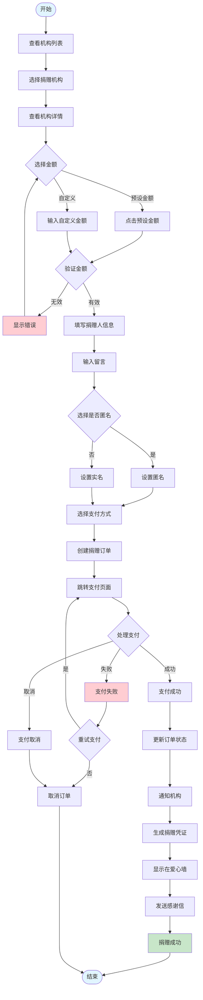
```mermaid
flowchart TD
    Start([开始]) --> ViewOrg[查看机构列表]
    ViewOrg --> SelectOrg[选择捐赠机构]
    SelectOrg --> ViewOrgDetail[查看机构详情]
    ViewOrgDetail --> SelectAmount{选择金额}
    
    SelectAmount -->|预设金额| ClickPreset[点击预设金额]
    SelectAmount -->|自定义| InputCustom[输入自定义金额]
    
    ClickPreset --> ValidateAmount{验证金额}
    InputCustom --> ValidateAmount
    
    ValidateAmount -->|无效| ShowError[显示错误]
    ShowError --> SelectAmount
    
    ValidateAmount -->|有效| FillInfo[填写捐赠人信息]
    FillInfo --> InputMessage[输入留言]
    InputMessage --> SelectAnonymous{选择是否匿名}
    
    SelectAnonymous -->|是| SetAnonymous[设置匿名]
    SelectAnonymous -->|否| SetRealName[设置实名]
    
    SetAnonymous --> SelectPayment[选择支付方式]
    SetRealName --> SelectPayment
    
    SelectPayment --> CreateOrder[创建捐赠订单]
    CreateOrder --> RedirectPay[跳转支付页面]
    RedirectPay --> ProcessPay{处理支付}
    
    ProcessPay -->|成功| PaySuccess[支付成功]
    ProcessPay -->|失败| PayFailed[支付失败]
    ProcessPay -->|取消| PayCancelled[支付取消]
    
    PaySuccess --> UpdateStatus[更新订单状态]
    UpdateStatus --> NotifyOrg[通知机构]
    NotifyOrg --> GenerateReceipt[生成捐赠凭证]
    GenerateReceipt --> ShowOnWall[显示在爱心墙]
    ShowOnWall --> SendThankYou[发送感谢信]
    SendThankYou --> Success[捐赠成功]
    Success --> End([结束])
    
    PayFailed --> Retry{重试支付}
    Retry -->|是| RedirectPay
    Retry -->|否| CancelOrder[取消订单]
    
    PayCancelled --> CancelOrder
    CancelOrder --> End
    
    style Start fill:#e1f5ff
    style End fill:#e1f5ff
    style Success fill:#c8e6c9
    style ShowError fill:#ffcdd2
    style PayFailed fill:#ffcdd2
```

## 10. 时序图 (Sequence Diagram)

### 10.1 用户登录时序图

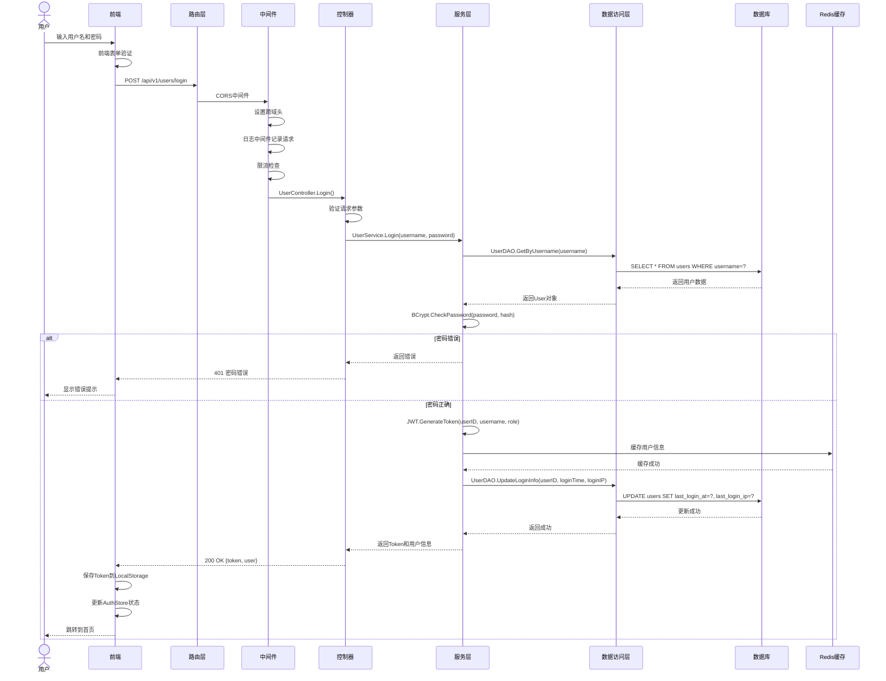
```mermaid
sequenceDiagram
    actor User as 用户
    participant Frontend as 前端
    participant Router as 路由层
    participant Middleware as 中间件
    participant Controller as 控制器
    participant Service as 服务层
    participant DAO as 数据访问层
    participant DB as 数据库
    participant Cache as Redis缓存
    
    User->>Frontend: 输入用户名和密码
    Frontend->>Frontend: 前端表单验证
    Frontend->>Router: POST /api/v1/users/login
    
    Router->>Middleware: CORS中间件
    Middleware->>Middleware: 设置跨域头
    Middleware->>Middleware: 日志中间件记录请求
    Middleware->>Middleware: 限流检查
    
    Middleware->>Controller: UserController.Login()
    Controller->>Controller: 验证请求参数
    Controller->>Service: UserService.Login(username, password)
    
    Service->>DAO: UserDAO.GetByUsername(username)
    DAO->>DB: SELECT * FROM users WHERE username=?
    DB-->>DAO: 返回用户数据
    DAO-->>Service: 返回User对象
    
    Service->>Service: BCrypt.CheckPassword(password, hash)
    
    alt 密码错误
        Service-->>Controller: 返回错误
        Controller-->>Frontend: 401 密码错误
        Frontend-->>User: 显示错误提示
    else 密码正确
        Service->>Service: JWT.GenerateToken(userID, username, role)
        Service->>Cache: 缓存用户信息
        Cache-->>Service: 缓存成功
        Service->>DAO: UserDAO.UpdateLoginInfo(userID, loginTime, loginIP)
        DAO->>DB: UPDATE users SET last_login_at=?, last_login_ip=?
        DB-->>DAO: 更新成功
        DAO-->>Service: 返回成功
        Service-->>Controller: 返回Token和用户信息
        Controller-->>Frontend: 200 OK {token, user}
        Frontend->>Frontend: 保存Token到LocalStorage
        Frontend->>Frontend: 更新AuthStore状态
        Frontend-->>User: 跳转到首页
    end
```

### 10.2 宠物发布审核时序图

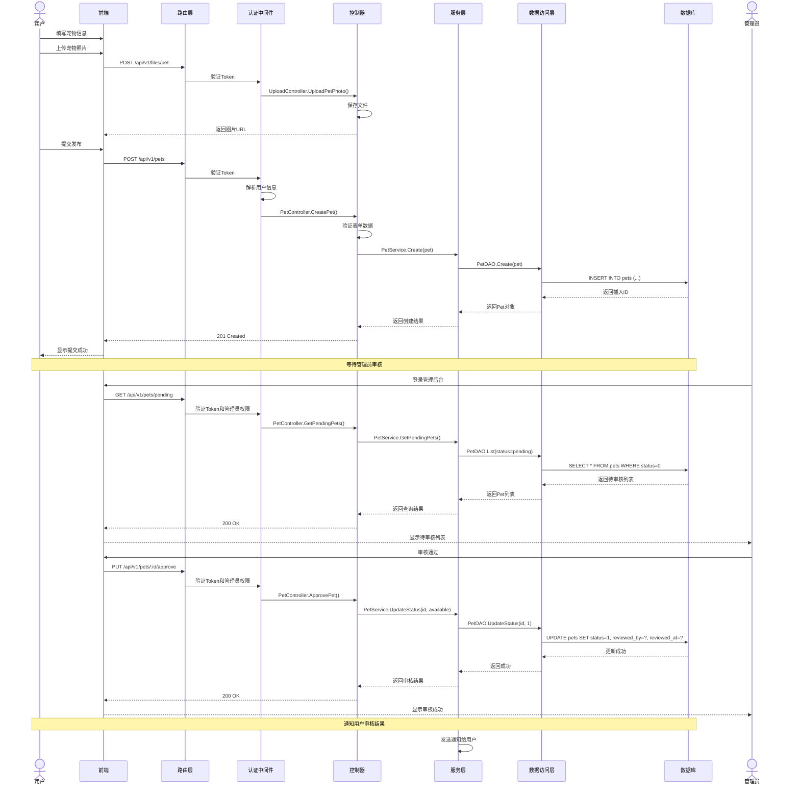
```mermaid
sequenceDiagram
    actor User as 用户
    participant Frontend as 前端
    participant Router as 路由层
    participant Auth as 认证中间件
    participant Controller as 控制器
    participant Service as 服务层
    participant DAO as 数据访问层
    participant DB as 数据库
    actor Admin as 管理员
    
    User->>Frontend: 填写宠物信息
    User->>Frontend: 上传宠物照片
    Frontend->>Router: POST /api/v1/files/pet
    Router->>Auth: 验证Token
    Auth->>Controller: UploadController.UploadPetPhoto()
    Controller->>Controller: 保存文件
    Controller-->>Frontend: 返回图片URL
    
    User->>Frontend: 提交发布
    Frontend->>Router: POST /api/v1/pets
    Router->>Auth: 验证Token
    Auth->>Auth: 解析用户信息
    Auth->>Controller: PetController.CreatePet()
    
    Controller->>Controller: 验证表单数据
    Controller->>Service: PetService.Create(pet)
    Service->>DAO: PetDAO.Create(pet)
    DAO->>DB: INSERT INTO pets (...)
    DB-->>DAO: 返回插入ID
    DAO-->>Service: 返回Pet对象
    Service-->>Controller: 返回创建结果
    Controller-->>Frontend: 201 Created
    Frontend-->>User: 显示提交成功
    
    Note over User,DB: 等待管理员审核
    
    Admin->>Frontend: 登录管理后台
    Frontend->>Router: GET /api/v1/pets/pending
    Router->>Auth: 验证Token和管理员权限
    Auth->>Controller: PetController.GetPendingPets()
    Controller->>Service: PetService.GetPendingPets()
    Service->>DAO: PetDAO.List(status=pending)
    DAO->>DB: SELECT * FROM pets WHERE status=0
    DB-->>DAO: 返回待审核列表
    DAO-->>Service: 返回Pet列表
    Service-->>Controller: 返回查询结果
    Controller-->>Frontend: 200 OK
    Frontend-->>Admin: 显示待审核列表
    
    Admin->>Frontend: 审核通过
    Frontend->>Router: PUT /api/v1/pets/:id/approve
    Router->>Auth: 验证Token和管理员权限
    Auth->>Controller: PetController.ApprovePet()
    Controller->>Service: PetService.UpdateStatus(id, available)
    Service->>DAO: PetDAO.UpdateStatus(id, 1)
    DAO->>DB: UPDATE pets SET status=1, reviewed_by=?, reviewed_at=?
    DB-->>DAO: 更新成功
    DAO-->>Service: 返回成功
    Service-->>Controller: 返回审核结果
    Controller-->>Frontend: 200 OK
    Frontend-->>Admin: 显示审核成功
    
    Note over User,DB: 通知用户审核结果
    Service->>Service: 发送通知给用户
```

### 10.3 领养申请审核时序图

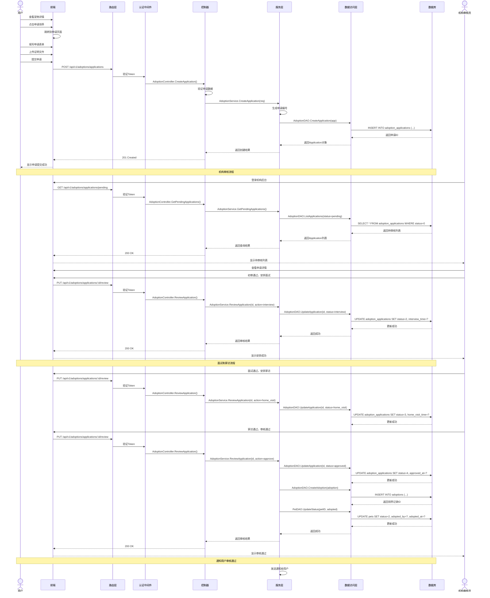
```mermaid
sequenceDiagram
    actor User as 用户
    participant Frontend as 前端
    participant Router as 路由层
    participant Auth as 认证中间件
    participant Controller as 控制器
    participant Service as 服务层
    participant DAO as 数据访问层
    participant DB as 数据库
    actor Org as 机构审核员
    
    User->>Frontend: 查看宠物详情
    User->>Frontend: 点击申请领养
    Frontend->>Frontend: 跳转到申请页面
    User->>Frontend: 填写申请表单
    User->>Frontend: 上传证明文件
    User->>Frontend: 提交申请
    
    Frontend->>Router: POST /api/v1/adoptions/applications
    Router->>Auth: 验证Token
    Auth->>Controller: AdoptionController.CreateApplication()
    Controller->>Controller: 验证申请数据
    Controller->>Service: AdoptionService.CreateApplication(req)
    
    Service->>Service: 生成申请编号
    Service->>DAO: AdoptionDAO.CreateApplication(app)
    DAO->>DB: INSERT INTO adoption_applications (...)
    DB-->>DAO: 返回申请ID
    DAO-->>Service: 返回Application对象
    Service-->>Controller: 返回创建结果
    Controller-->>Frontend: 201 Created
    Frontend-->>User: 显示申请提交成功
    
    Note over User,DB: 机构审核流程
    
    Org->>Frontend: 登录机构后台
    Frontend->>Router: GET /api/v1/adoptions/applications/pending
    Router->>Auth: 验证Token
    Auth->>Controller: AdoptionController.GetPendingApplications()
    Controller->>Service: AdoptionService.GetPendingApplications()
    Service->>DAO: AdoptionDAO.ListApplications(status=pending)
    DAO->>DB: SELECT * FROM adoption_applications WHERE status=0
    DB-->>DAO: 返回待审核列表
    DAO-->>Service: 返回Application列表
    Service-->>Controller: 返回查询结果
    Controller-->>Frontend: 200 OK
    Frontend-->>Org: 显示待审核列表
    
    Org->>Frontend: 查看申请详情
    Org->>Frontend: 初审通过，安排面试
    Frontend->>Router: PUT /api/v1/adoptions/applications/:id/review
    Router->>Auth: 验证Token
    Auth->>Controller: AdoptionController.ReviewApplication()
    Controller->>Service: AdoptionService.ReviewApplication(id, action=interview)
    Service->>DAO: AdoptionDAO.UpdateApplication(id, status=interview)
    DAO->>DB: UPDATE adoption_applications SET status=2, interview_time=?
    DB-->>DAO: 更新成功
    DAO-->>Service: 返回成功
    Service-->>Controller: 返回审核结果
    Controller-->>Frontend: 200 OK
    Frontend-->>Org: 显示安排成功
    
    Note over User,DB: 面试和家访流程
    
    Org->>Frontend: 面试通过，安排家访
    Frontend->>Router: PUT /api/v1/adoptions/applications/:id/review
    Router->>Auth: 验证Token
    Auth->>Controller: AdoptionController.ReviewApplication()
    Controller->>Service: AdoptionService.ReviewApplication(id, action=home_visit)
    Service->>DAO: AdoptionDAO.UpdateApplication(id, status=home_visit)
    DAO->>DB: UPDATE adoption_applications SET status=3, home_visit_time=?
    DB-->>DAO: 更新成功
    
    Org->>Frontend: 家访通过，审核通过
    Frontend->>Router: PUT /api/v1/adoptions/applications/:id/review
    Router->>Auth: 验证Token
    Auth->>Controller: AdoptionController.ReviewApplication()
    Controller->>Service: AdoptionService.ReviewApplication(id, action=approve)
    
    Service->>DAO: AdoptionDAO.UpdateApplication(id, status=approved)
    DAO->>DB: UPDATE adoption_applications SET status=4, approved_at=?
    DB-->>DAO: 更新成功
    
    Service->>DAO: AdoptionDAO.CreateAdoption(adoption)
    DAO->>DB: INSERT INTO adoptions (...)
    DB-->>DAO: 返回领养记录ID
    
    Service->>DAO: PetDAO.UpdateStatus(petID, adopted)
    DAO->>DB: UPDATE pets SET status=2, adopted_by=?, adopted_at=?
    DB-->>DAO: 更新成功
    
    DAO-->>Service: 返回成功
    Service-->>Controller: 返回审核结果
    Controller-->>Frontend: 200 OK
    Frontend-->>Org: 显示审核通过
    
    Note over User,DB: 通知用户审核通过
    Service->>Service: 发送通知给用户
```

### 10.4 机构注册认证时序图

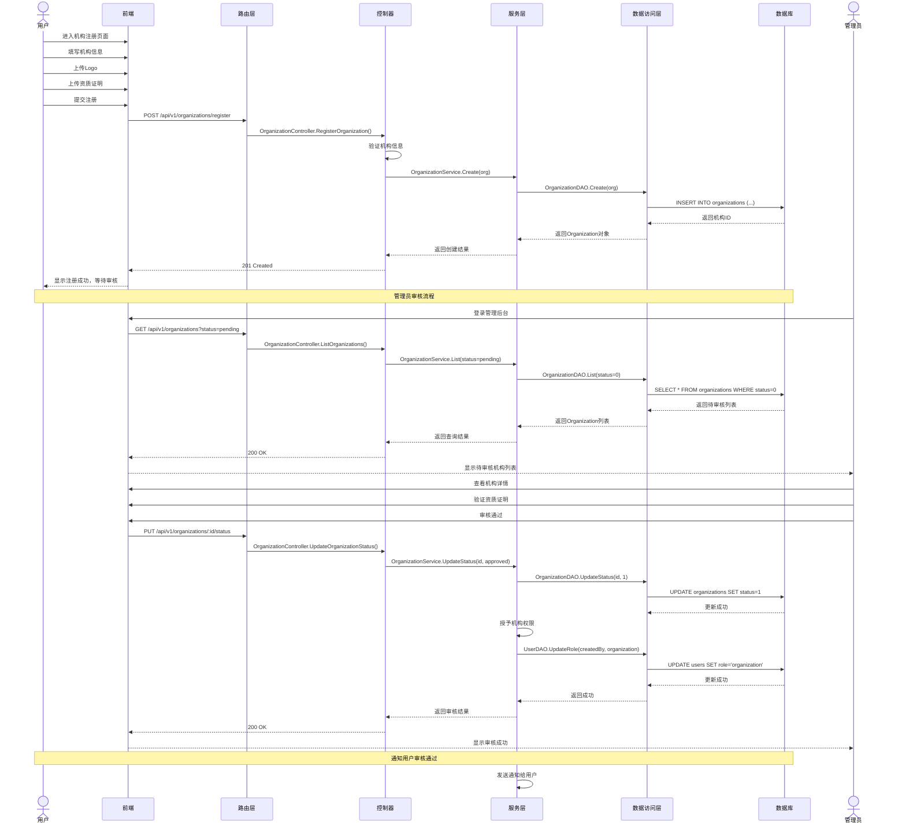
```mermaid
sequenceDiagram
    actor User as 用户
    participant Frontend as 前端
    participant Router as 路由层
    participant Controller as 控制器
    participant Service as 服务层
    participant DAO as 数据访问层
    participant DB as 数据库
    actor Admin as 管理员
    
    User->>Frontend: 进入机构注册页面
    User->>Frontend: 填写机构信息
    User->>Frontend: 上传Logo
    User->>Frontend: 上传资质证明
    User->>Frontend: 提交注册
    
    Frontend->>Router: POST /api/v1/organizations/register
    Router->>Controller: OrganizationController.RegisterOrganization()
    Controller->>Controller: 验证机构信息
    Controller->>Service: OrganizationService.Create(org)
    
    Service->>DAO: OrganizationDAO.Create(org)
    DAO->>DB: INSERT INTO organizations (...)
    DB-->>DAO: 返回机构ID
    DAO-->>Service: 返回Organization对象
    Service-->>Controller: 返回创建结果
    Controller-->>Frontend: 201 Created
    Frontend-->>User: 显示注册成功，等待审核
    
    Note over User,DB: 管理员审核流程
    
    Admin->>Frontend: 登录管理后台
    Frontend->>Router: GET /api/v1/organizations?status=pending
    Router->>Controller: OrganizationController.ListOrganizations()
    Controller->>Service: OrganizationService.List(status=pending)
    Service->>DAO: OrganizationDAO.List(status=0)
    DAO->>DB: SELECT * FROM organizations WHERE status=0
    DB-->>DAO: 返回待审核列表
    DAO-->>Service: 返回Organization列表
    Service-->>Controller: 返回查询结果
    Controller-->>Frontend: 200 OK
    Frontend-->>Admin: 显示待审核机构列表
    
    Admin->>Frontend: 查看机构详情
    Admin->>Frontend: 验证资质证明
    Admin->>Frontend: 审核通过
    Frontend->>Router: PUT /api/v1/organizations/:id/status
    Router->>Controller: OrganizationController.UpdateOrganizationStatus()
    Controller->>Service: OrganizationService.UpdateStatus(id, approved)
    
    Service->>DAO: OrganizationDAO.UpdateStatus(id, 1)
    DAO->>DB: UPDATE organizations SET status=1
    DB-->>DAO: 更新成功
    
    Service->>Service: 授予机构权限
    Service->>DAO: UserDAO.UpdateRole(createdBy, organization)
    DAO->>DB: UPDATE users SET role='organization'
    DB-->>DAO: 更新成功
    
    DAO-->>Service: 返回成功
    Service-->>Controller: 返回审核结果
    Controller-->>Frontend: 200 OK
    Frontend-->>Admin: 显示审核成功
    
    Note over User,DB: 通知用户审核通过
    Service->>Service: 发送通知给用户
```

### 10.5 捐赠支付时序图

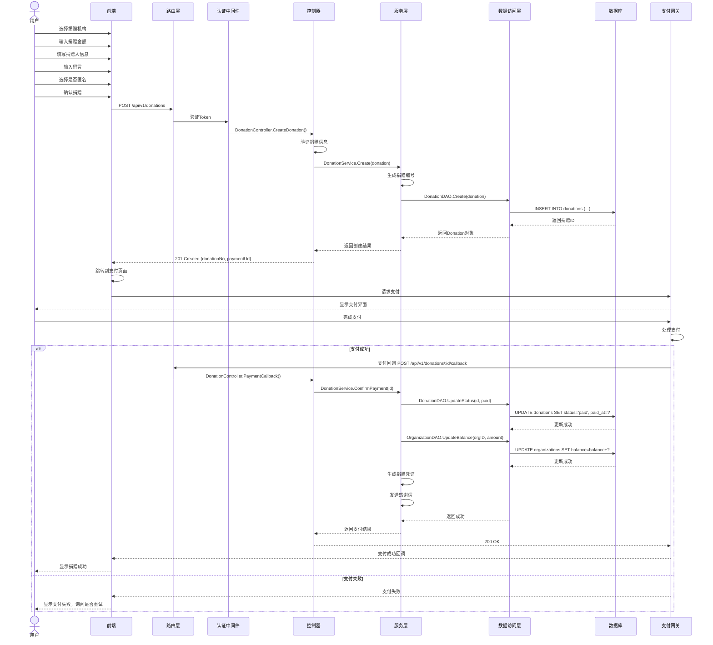
```mermaid
sequenceDiagram
    actor User as 用户
    participant Frontend as 前端
    participant Router as 路由层
    participant Auth as 认证中间件
    participant Controller as 控制器
    participant Service as 服务层
    participant DAO as 数据访问层
    participant DB as 数据库
    participant Payment as 支付网关
    
    User->>Frontend: 选择捐赠机构
    User->>Frontend: 输入捐赠金额
    User->>Frontend: 填写捐赠人信息
    User->>Frontend: 输入留言
    User->>Frontend: 选择是否匿名
    User->>Frontend: 确认捐赠
    
    Frontend->>Router: POST /api/v1/donations
    Router->>Auth: 验证Token
    Auth->>Controller: DonationController.CreateDonation()
    Controller->>Controller: 验证捐赠信息
    Controller->>Service: DonationService.Create(donation)
    
    Service->>Service: 生成捐赠编号
    Service->>DAO: DonationDAO.Create(donation)
    DAO->>DB: INSERT INTO donations (...)
    DB-->>DAO: 返回捐赠ID
    DAO-->>Service: 返回Donation对象
    Service-->>Controller: 返回创建结果
    Controller-->>Frontend: 201 Created {donationNo, paymentUrl}
    
    Frontend->>Frontend: 跳转到支付页面
    Frontend->>Payment: 请求支付
    Payment-->>User: 显示支付界面
    
    User->>Payment: 完成支付
    Payment->>Payment: 处理支付
    
    alt 支付成功
        Payment->>Router: 支付回调 POST /api/v1/donations/:id/callback
        Router->>Controller: DonationController.PaymentCallback()
        Controller->>Service: DonationService.ConfirmPayment(id)
        Service->>DAO: DonationDAO.UpdateStatus(id, paid)
        DAO->>DB: UPDATE donations SET status='paid', paid_at=?
        DB-->>DAO: 更新成功
        
        Service->>DAO: OrganizationDAO.UpdateBalance(orgID, amount)
        DAO->>DB: UPDATE organizations SET balance=balance+?
        DB-->>DAO: 更新成功
        
        Service->>Service: 生成捐赠凭证
        Service->>Service: 发送感谢信
        
        DAO-->>Service: 返回成功
        Service-->>Controller: 返回支付结果
        Controller-->>Payment: 200 OK
        Payment-->>Frontend: 支付成功回调
        Frontend-->>User: 显示捐赠成功
    else 支付失败
        Payment-->>Frontend: 支付失败
        Frontend-->>User: 显示支付失败，询问是否重试
    end
```

### 10.6 社区动态发布时序图

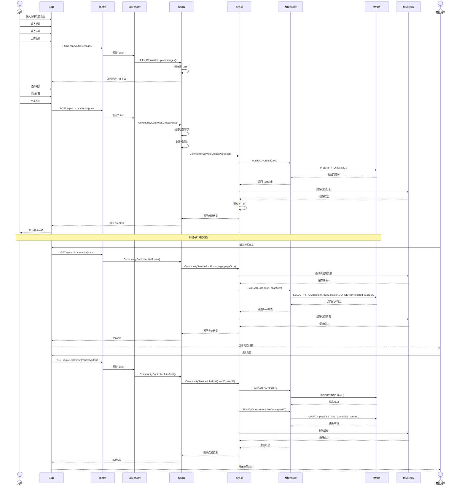
```mermaid
sequenceDiagram
    actor User as 用户
    participant Frontend as 前端
    participant Router as 路由层
    participant Auth as 认证中间件
    participant Controller as 控制器
    participant Service as 服务层
    participant DAO as 数据访问层
    participant DB as 数据库
    participant Cache as Redis缓存
    
    User->>Frontend: 进入发布动态页面
    User->>Frontend: 输入标题
    User->>Frontend: 输入内容
    User->>Frontend: 上传图片
    Frontend->>Router: POST /api/v1/files/images
    Router->>Auth: 验证Token
    Auth->>Controller: UploadController.UploadImages()
    Controller->>Controller: 保存图片文件
    Controller-->>Frontend: 返回图片URL列表
    
    User->>Frontend: 选择分类
    User->>Frontend: 添加标签
    User->>Frontend: 点击发布
    
    Frontend->>Router: POST /api/v1/community/posts
    Router->>Auth: 验证Token
    Auth->>Controller: CommunityController.CreatePost()
    Controller->>Controller: 验证动态内容
    Controller->>Controller: 敏感词过滤
    Controller->>Service: CommunityService.CreatePost(post)
    
    Service->>DAO: PostDAO.Create(post)
    DAO->>DB: INSERT INTO posts (...)
    DB-->>DAO: 返回动态ID
    DAO-->>Service: 返回Post对象
    
    Service->>Cache: 缓存动态信息
    Cache-->>Service: 缓存成功
    
    Service->>Service: 通知关注者
    
    Service-->>Controller: 返回创建结果
    Controller-->>Frontend: 201 Created
    Frontend-->>User: 显示发布成功
    
    Note over User,DB: 其他用户浏览动态
    
    actor OtherUser as 其他用户
    OtherUser->>Frontend: 浏览社区动态
    Frontend->>Router: GET /api/v1/community/posts
    Router->>Controller: CommunityController.ListPosts()
    Controller->>Service: CommunityService.ListPosts(page, pageSize)
    
    Service->>Cache: 尝试从缓存获取
    Cache-->>Service: 缓存未命中
    
    Service->>DAO: PostDAO.List(page, pageSize)
    DAO->>DB: SELECT * FROM posts WHERE status=1 ORDER BY created_at DESC
    DB-->>DAO: 返回动态列表
    DAO-->>Service: 返回Post列表
    
    Service->>Cache: 缓存动态列表
    Cache-->>Service: 缓存成功
    
    Service-->>Controller: 返回查询结果
    Controller-->>Frontend: 200 OK
    Frontend-->>OtherUser: 显示动态列表
    
    OtherUser->>Frontend: 点赞动态
    Frontend->>Router: POST /api/v1/community/posts/:id/like
    Router->>Auth: 验证Token
    Auth->>Controller: CommunityController.LikePost()
    Controller->>Service: CommunityService.LikePost(postID, userID)
    
    Service->>DAO: LikeDAO.Create(like)
    DAO->>DB: INSERT INTO likes (...)
    DB-->>DAO: 插入成功
    
    Service->>DAO: PostDAO.IncrementLikeCount(postID)
    DAO->>DB: UPDATE posts SET like_count=like_count+1
    DB-->>DAO: 更新成功
    
    Service->>Cache: 删除缓存
    Cache-->>Service: 删除成功
    
    DAO-->>Service: 返回成功
    Service-->>Controller: 返回点赞结果
    Controller-->>Frontend: 200 OK
    Frontend-->>OtherUser: 显示点赞成功
```

---

## 总结

本文档提供了爱心宠物领养平台的完整UML模型，包括：

1. **功能结构图** - 展示系统的功能模块层次结构
2. **总体业务流程图** - 描述平台整体业务流程
3. **功能模块业务流程图** - 详细描述各模块的业务流程
4. **用例图** - 展示系统参与者和用例的关系
5. **类图** - 描述系统核心业务类及其关系
6. **包图** - 展示系统的包结构和依赖关系
7. **ER图** - 描述数据库实体关系
8. **状态图** - 展示核心实体的状态转换
9. **活动图** - 描述关键业务活动流程
10. **时序图** - 展示系统交互的时序关系

这些UML图表全面描述了系统的静态结构和动态行为，为系统开发、测试和维护提供了完整的参考文档。

---

**文档版本**: v1.0  
**创建日期**: 2025-12-17  
**最后更新**: 2025-12-17

