# 爱心宠物领养平台 - UML模型图

## 目录

1. [功能结构图](#1-功能结构图)
2. [总体业务流程图](#2-总体业务流程图)
3. [功能模块业务流程图](#3-功能模块业务流程图)
4. [用例图](#4-用例图)
5. [类图](#5-类图)
6. [包图](#6-包图)
7. [ER图](#7-er图)
8. [状态图](#8-状态图)
9. [活动图](#9-活动图)
10. [时序图](#10-时序图)

---

## 1. 功能结构图

### 1.1 系统功能结构总图

```mermaid
graph TB
    System[爱心宠物领养平台]
    
    System --> UserModule[用户管理模块]
    System --> PetModule[宠物管理模块]
    System --> AdoptionModule[领养管理模块]
    System --> OrgModule[机构管理模块]
    System --> CommunityModule[社区互动模块]
    System --> DonationModule[捐赠管理模块]
    System --> AdminModule[后台管理模块]
    
    UserModule --> UserReg[用户注册]
    UserModule --> UserLogin[用户登录]
    UserModule --> UserProfile[个人信息管理]
    UserModule --> UserAuth[身份认证]
    
    PetModule --> PetPublish[宠物发布]
    PetModule --> PetBrowse[宠物浏览]
    PetModule --> PetSearch[宠物搜索]
    PetModule --> PetDetail[宠物详情]
    PetModule --> PetManage[我的宠物]
    
    AdoptionModule --> AdoptApply[提交申请]
    AdoptionModule --> AdoptReview[申请审核]
    AdoptionModule --> AdoptRecord[领养记录]
    AdoptionModule --> AdoptFollow[领养回访]
    
    OrgModule --> OrgRegister[机构注册]
    OrgModule --> OrgVerify[机构认证]
    OrgModule --> OrgManage[机构管理]
    OrgModule --> OrgDisplay[机构展示]
    
    CommunityModule --> PostPublish[发布动态]
    CommunityModule --> PostBrowse[浏览动态]
    CommunityModule --> PostComment[评论互动]
    CommunityModule --> PostLike[点赞收藏]
    
    DonationModule --> DonateCreate[发起捐赠]
    DonationModule --> DonateRecord[捐赠记录]
    DonationModule --> DonateWall[爱心墙]
    DonationModule --> DonateStats[捐赠统计]
    
    AdminModule --> AdminUser[用户管理]
    AdminModule --> AdminPet[宠物审核]
    AdminModule --> AdminAdoption[领养审核]
    AdminModule --> AdminOrg[机构审核]
    AdminModule --> AdminStats[数据统计]
    
    style System fill:#e1f5ff
    style UserModule fill:#fff4e1
    style PetModule fill:#e8f5e9
    style AdoptionModule fill:#f3e5f5
    style OrgModule fill:#fff3e0
    style CommunityModule fill:#fce4ec
    style DonationModule fill:#e0f2f1
    style AdminModule fill:#ffebee
```

### 1.2 用户管理模块功能结构

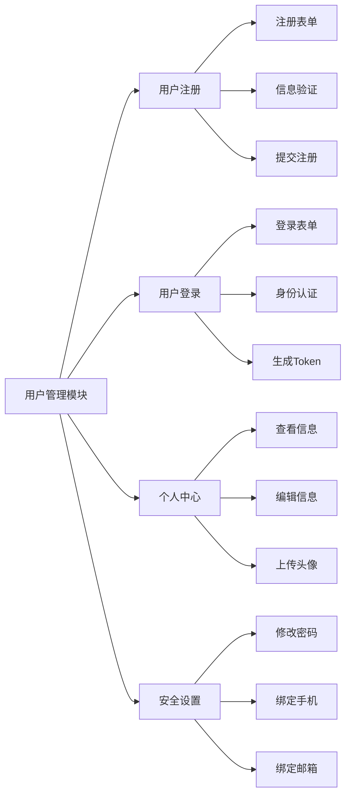

### 1.3 宠物管理模块功能结构

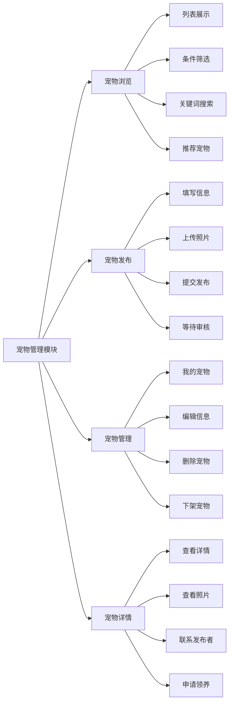

### 1.4 领养管理模块功能结构

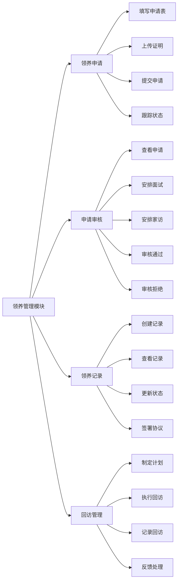

### 1.5 机构管理模块功能结构

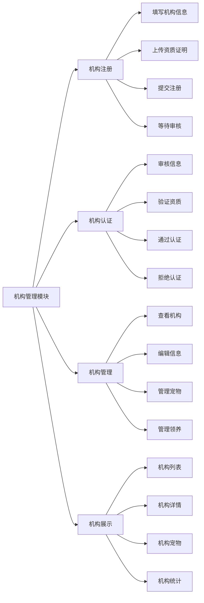

### 1.6 社区互动模块功能结构

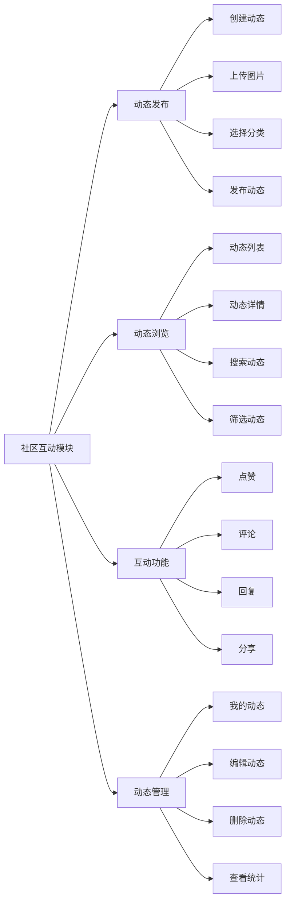

### 1.7 捐赠管理模块功能结构

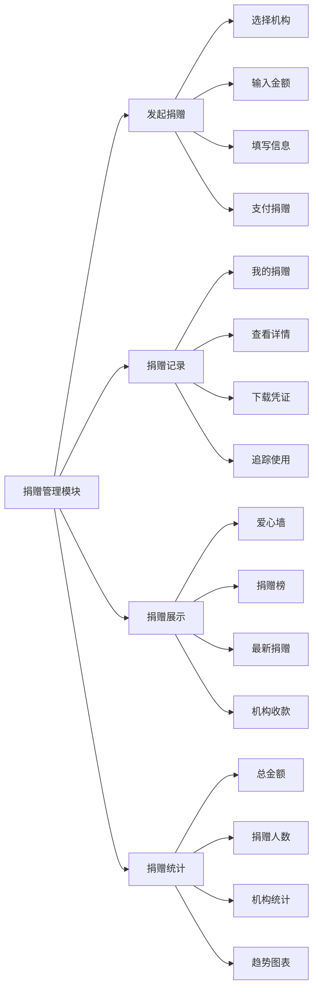

### 1.8 后台管理模块功能结构

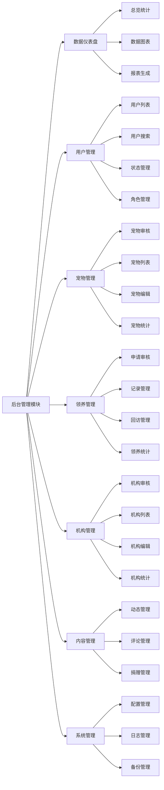

## 2. 总体业务流程图

### 2.1 平台整体业务流程

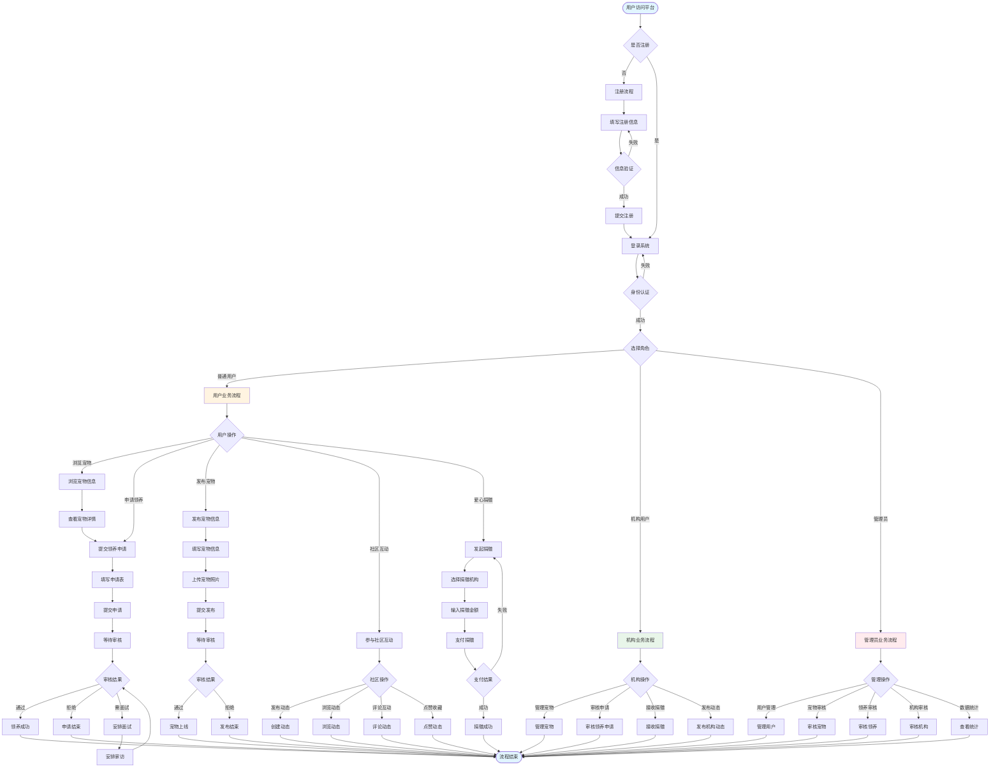


## 3. 功能模块业务流程图

### 3.1 用户注册登录流程

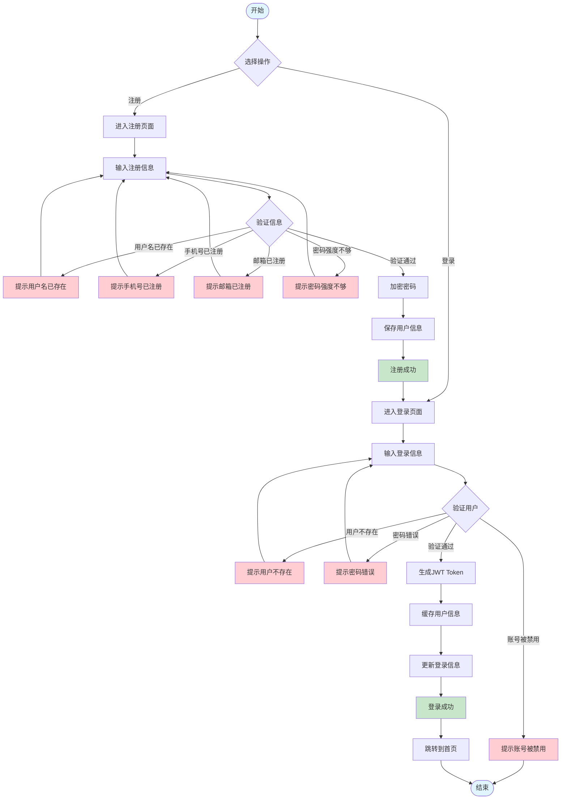

### 3.2 宠物发布审核流程

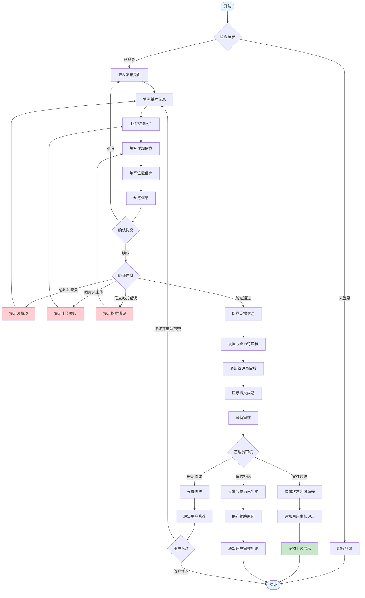

### 3.3 领养申请审核流程

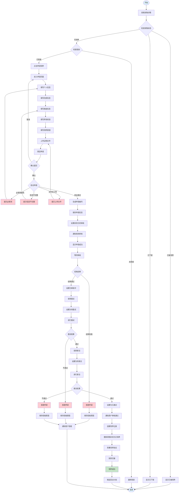

### 3.4 机构注册认证流程

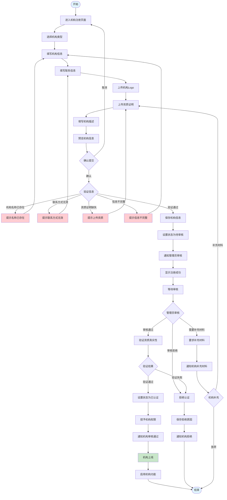

### 3.5 社区动态发布流程

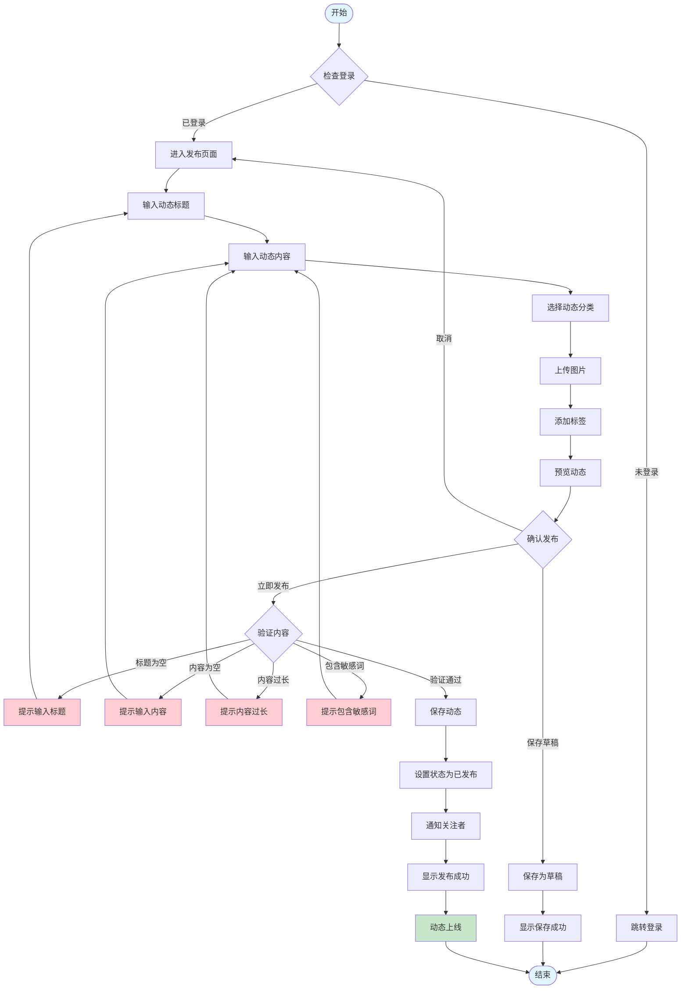

### 3.6 捐赠支付流程

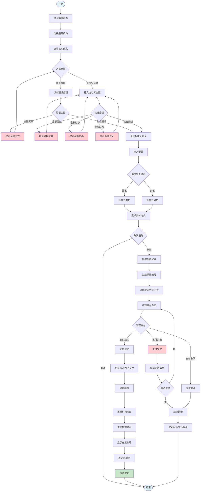


## 4. 用例图 (Use Case Diagram)

### 4.1 系统总体用例图

```mermaid
graph TB
    %% 参与者
    User((普通用户))
    Org((机构用户))
    Admin((管理员))
    Guest((访客))
    
    %% 用例
    subgraph "爱心宠物领养平台"
        %% 访客用例
        UC1[浏览宠物]
        UC2[查看宠物详情]
        UC3[浏览社区动态]
        UC4[查看机构信息]
        UC5[用户注册]
        UC6[用户登录]
        
        %% 普通用户用例
        UC7[发布宠物]
        UC8[管理我的宠物]
        UC9[申请领养]
        UC10[查看我的申请]
        UC11[发布动态]
        UC12[评论互动]
        UC13[发起捐赠]
        UC14[查看捐赠记录]
        UC15[个人信息管理]
        
        %% 机构用户用例
        UC16[机构注册]
        UC17[管理机构信息]
        UC18[审核领养申请]
        UC19[管理机构宠物]
        UC20[接收捐赠]
        UC21[发布机构动态]
        
        %% 管理员用例
        UC22[用户管理]
        UC23[宠物审核]
        UC24[领养审核]
        UC25[机构审核]
        UC26[内容管理]
        UC27[数据统计]
        UC28[系统配置]
    end
    
    %% 关联关系
    Guest --> UC1
    Guest --> UC2
    Guest --> UC3
    Guest --> UC4
    Guest --> UC5
    Guest --> UC6
    
    User --> UC1
    User --> UC2
    User --> UC3
    User --> UC4
    User --> UC6
    User --> UC7
    User --> UC8
    User --> UC9
    User --> UC10
    User --> UC11
    User --> UC12
    User --> UC13
    User --> UC14
    User --> UC15
    
    Org --> UC1
    Org --> UC2
    Org --> UC3
    Org --> UC6
    Org --> UC16
    Org --> UC17
    Org --> UC18
    Org --> UC19
    Org --> UC20
    Org --> UC21
    
    Admin --> UC22
    Admin --> UC23
    Admin --> UC24
    Admin --> UC25
    Admin --> UC26
    Admin --> UC27
    Admin --> UC28
    
    %% 包含关系
    UC7 -.->|include| UC6
    UC9 -.->|include| UC6
    UC11 -.->|include| UC6
    UC13 -.->|include| UC6
    UC18 -.->|include| UC6
    UC22 -.->|include| UC6
    UC23 -.->|include| UC6
    UC24 -.->|include| UC6
    UC25 -.->|include| UC6
```

### 4.2 用户管理用例图

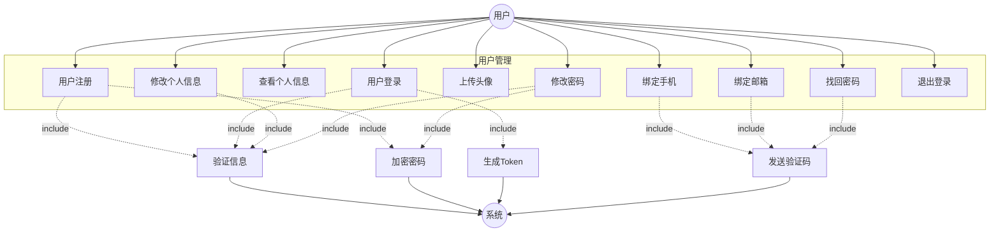

### 4.3 宠物管理用例图

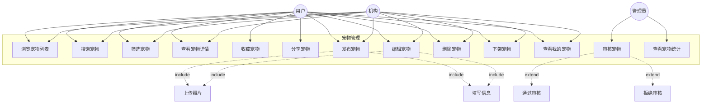

### 4.4 领养管理用例图

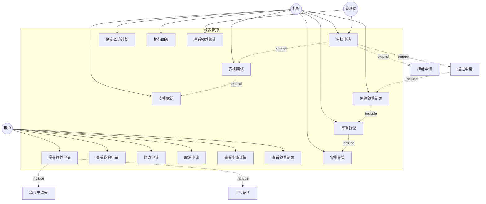

### 4.5 社区互动用例图

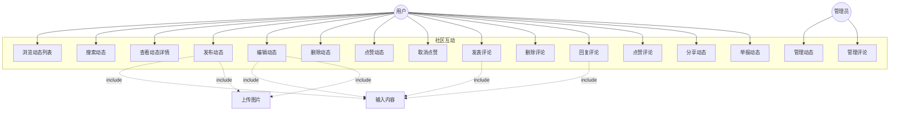

## 5. 类图 (Class Diagram)

### 5.1 核心业务类图

```mermaid
classDiagram
    %% 用户相关
    class User {
        +int64 ID
        +string Username
        +string Password
        +string RealName
        +string Phone
        +string Email
        +string Avatar
        +Gender Gender
        +Date Birthday
        +string IDCard
        +string Address
        +UserRole Role
        +UserStatus Status
        +DateTime LastLoginAt
        +string LastLoginIP
        +DateTime CreatedAt
        +DateTime UpdatedAt
        +IsAdmin() bool
        +IsOrganization() bool
        +IsActive() bool
        +MaskSensitiveInfo() User
    }
    
    class UserRole {
        <<enumeration>>
        USER
        ORGANIZATION
        VOLUNTEER
        ADMIN
    }
    
    class UserStatus {
        <<enumeration>>
        DISABLED
        NORMAL
    }
    
    %% 宠物相关
    class Pet {
        +uint64 ID
        +string Name
        +PetType Type
        +string Breed
        +PetGender Gender
        +int Age
        +PetSize Size
        +string Color
        +float Weight
        +bool IsVaccinated
        +bool IsSterilized
        +string HealthStatus
        +string Description
        +string Character
        +string[] Photos
        +string CoverPhoto
        +Location Location
        +int64 UserID
        +PetStatus Status
        +int ViewCount
        +int FavoriteCount
        +DateTime CreatedAt
        +DateTime UpdatedAt
        +IncrementViewCount()
        +IsAvailable() bool
    }
    
    class PetType {
        <<enumeration>>
        DOG
        CAT
        RABBIT
        BIRD
        OTHER
    }
    
    class PetGender {
        <<enumeration>>
        MALE
        FEMALE
        UNKNOWN
    }
    
    class PetStatus {
        <<enumeration>>
        PENDING
        AVAILABLE
        ADOPTED
        OFFLINE
    }
    
    class PetSize {
        <<enumeration>>
        SMALL
        MEDIUM
        LARGE
    }
    
    class Location {
        +string Province
        +string City
        +string District
        +string Address
        +GetFullAddress() string
    }
    
    %% 领养相关
    class AdoptionApplication {
        +uint64 ID
        +string ApplicationNo
        +int64 UserID
        +uint64 PetID
        +uint64 OrganizationID
        +ApplicantInfo ApplicantInfo
        +HousingInfo HousingInfo
        +FamilyInfo FamilyInfo
        +PetExperience PetExperience
        +string AdoptionReason
        +string HowToCare
        +string EmergencyPlan
        +ApplicationStatus Status
        +ReviewInfo ReviewInfo
        +DateTime CreatedAt
        +DateTime UpdatedAt
        +CanModify() bool
        +CanCancel() bool
    }
    
    class ApplicantInfo {
        +string Name
        +string Phone
        +string IDCard
        +string Address
        +string IDCardImage
        +string HousingProof
    }
    
    class HousingInfo {
        +HousingType Type
        +int Area
        +bool HasYard
    }
    
    class FamilyInfo {
        +int Members
        +bool HasChildren
        +string ChildrenAge
        +bool FamilyAgree
    }
    
    class PetExperience {
        +bool HasExperience
        +string Experience
        +string CurrentPets
    }
    
    class ReviewInfo {
        +int64 ReviewerID
        +string Comment
        +DateTime InterviewTime
        +DateTime HomeVisitTime
        +DateTime ApprovedAt
        +DateTime RejectedAt
        +string RejectionReason
    }
    
    class ApplicationStatus {
        <<enumeration>>
        PENDING
        REVIEWING
        INTERVIEW
        HOME_VISIT
        APPROVED
        REJECTED
        CANCELLED
    }
    
    class HousingType {
        <<enumeration>>
        APARTMENT
        HOUSE
        VILLA
        OTHER
    }
    
    class Adoption {
        +uint64 ID
        +uint64 ApplicationID
        +int64 UserID
        +uint64 PetID
        +uint64 OrganizationID
        +Date AdoptionDate
        +string HandoverLocation
        +string AgreementURL
        +bool AgreementSigned
        +FollowUpPlan FollowUpPlan
        +AdoptionStatus Status
        +string Notes
        +DateTime CreatedAt
        +DateTime UpdatedAt
        +IsActive() bool
    }
    
    class FollowUpPlan {
        +FollowUpSchedule[] Schedules
        +AddSchedule(schedule FollowUpSchedule)
        +GetNextSchedule() FollowUpSchedule
    }
    
    class FollowUpSchedule {
        +Date ScheduledDate
        +string Type
        +string Status
        +string Result
        +DateTime CompletedAt
    }
    
    class AdoptionStatus {
        <<enumeration>>
        ACTIVE
        RETURNED
        DECEASED
    }
    
    %% 机构相关
    class Organization {
        +uint64 ID
        +string Name
        +string Type
        +string Logo
        +string Description
        +Location Location
        +ContactInfo ContactInfo
        +string[] CredentialUrls
        +OrganizationStatus Status
        +string RejectReason
        +uint64 CreatedBy
        +DateTime CreatedAt
        +DateTime UpdatedAt
        +IsApproved() bool
    }
    
    class ContactInfo {
        +string ContactName
        +string ContactPhone
        +string ContactEmail
        +string Phone
        +string Email
    }
    
    class OrganizationStatus {
        <<enumeration>>
        PENDING
        APPROVED
        REJECTED
    }
    
    %% 社区相关
    class Post {
        +uint64 ID
        +int64 UserID
        +string Title
        +string Content
        +string[] Images
        +string Category
        +int ViewCount
        +int LikeCount
        +int CommentCount
        +PostStatus Status
        +DateTime CreatedAt
        +DateTime UpdatedAt
        +IncrementViewCount()
        +IncrementLikeCount()
        +IncrementCommentCount()
    }
    
    class PostStatus {
        <<enumeration>>
        DRAFT
        PUBLISHED
        HIDDEN
    }
    
    class Comment {
        +uint64 ID
        +uint64 PostID
        +int64 UserID
        +uint64 ParentID
        +string Content
        +int LikeCount
        +DateTime CreatedAt
        +DateTime UpdatedAt
        +IsReply() bool
    }
    
    class Like {
        +uint64 ID
        +int64 UserID
        +string TargetType
        +uint64 TargetID
        +DateTime CreatedAt
    }
    
    %% 捐赠相关
    class Donation {
        +uint64 ID
        +string DonationNo
        +int64 UserID
        +uint64 OrganizationID
        +decimal Amount
        +string PaymentMethod
        +DonorInfo DonorInfo
        +string Message
        +bool IsAnonymous
        +DonationStatus Status
        +DateTime PaidAt
        +DateTime ConfirmedAt
        +DateTime CreatedAt
        +DateTime UpdatedAt
        +IsPaid() bool
        +IsConfirmed() bool
    }
    
    class DonorInfo {
        +string Name
        +string Phone
    }
    
    class DonationStatus {
        <<enumeration>>
        PENDING
        PAID
        CONFIRMED
        CANCELLED
    }
    
    %% 关联关系
    User "1" --> "0..*" Pet : publishes
    User "1" --> "0..*" AdoptionApplication : submits
    User "1" --> "0..*" Adoption : adopts
    User "1" --> "0..*" Organization : creates
    User "1" --> "0..*" Post : publishes
    User "1" --> "0..*" Comment : writes
    User "1" --> "0..*" Like : likes
    User "1" --> "0..*" Donation : donates
    
    Pet "1" --> "0..*" AdoptionApplication : receives
    Pet "1" --> "0..1" Adoption : adopted_as
    Pet "*" --> "1" User : belongs_to
    Pet --> Location : has
    Pet --> PetType : has
    Pet --> PetGender : has
    Pet --> PetStatus : has
    Pet --> PetSize : has
    
    AdoptionApplication "1" --> "0..1" Adoption : becomes
    AdoptionApplication --> ApplicantInfo : has
    AdoptionApplication --> HousingInfo : has
    AdoptionApplication --> FamilyInfo : has
    AdoptionApplication --> PetExperience : has
    AdoptionApplication --> ReviewInfo : has
    AdoptionApplication --> ApplicationStatus : has
    
    Adoption --> FollowUpPlan : has
    Adoption --> AdoptionStatus : has
    FollowUpPlan "1" --> "*" FollowUpSchedule : contains
    
    Organization --> Location : has
    Organization --> ContactInfo : has
    Organization --> OrganizationStatus : has
    Organization "1" --> "0..*" Pet : manages
    Organization "1" --> "0..*" AdoptionApplication : reviews
    Organization "1" --> "0..*" Adoption : facilitates
    Organization "1" --> "0..*" Donation : receives
    
    Post "1" --> "0..*" Comment : has
    Post "1" --> "0..*" Like : receives
    Post --> PostStatus : has
    
    Comment "1" --> "0..*" Like : receives
    Comment "0..1" --> "0..*" Comment : replies
    
    Donation --> DonorInfo : has
    Donation --> DonationStatus : has
    
    User --> UserRole : has
    User --> UserStatus : has
```


## 6. 包图 (Package Diagram)

### 6.1 后端系统包图

```mermaid
graph TB
    subgraph "应用层 Application"
        Main[main]
    end
    
    subgraph "配置层 Configuration"
        Config[config]
    end
    
    subgraph "表现层 Presentation"
        Router[router]
        Middleware[middleware]
        Controller[controller]
    end
    
    subgraph "业务层 Business"
        Service[service]
    end
    
    subgraph "持久层 Persistence"
        DAO[dao]
        Model[model]
    end
    
    subgraph "基础设施层 Infrastructure"
        Database[database]
        Cache[cache]
        Logger[logger]
        Utils[utils]
        Response[response]
    end
    
    subgraph "外部服务 External Services"
        MySQL[(MySQL)]
        Redis[(Redis)]
        OSS[OSS]
        Email[Email]
        SMS[SMS]
    end
    
    Main --> Config
    Main --> Router
    Main --> Database
    Main --> Cache
    Main --> Logger
    
    Router --> Middleware
    Router --> Controller
    
    Middleware --> Utils
    Middleware --> Logger
    
    Controller --> Service
    Controller --> Response
    Controller --> Logger
    
    Service --> DAO
    Service --> Cache
    Service --> Utils
    Service --> Logger
    
    DAO --> Model
    DAO --> Database
    DAO --> Logger
    
    Database --> MySQL
    Cache --> Redis
    Utils --> OSS
    Utils --> Email
    Utils --> SMS
    
    style Main fill:#e1f5ff
    style Config fill:#fff4e1
    style Router fill:#e8f5e9
    style Service fill:#f3e5f5
    style DAO fill:#fff3e0
    style Database fill:#ffebee
```

### 6.2 前端系统包图

```mermaid
graph TB
    subgraph "入口层 Entry"
        Main[main]
        App[App]
    end
    
    subgraph "路由层 Router"
        RouterConfig[router]
    end
    
    subgraph "视图层 View"
        Pages[pages]
        Components[components]
    end
    
    subgraph "状态层 State"
        Store[store]
    end
    
    subgraph "服务层 Service"
        API[api]
        AdminAPI[adminApi]
    end
    
    subgraph "工具层 Utility"
        Utils[utils]
    end
    
    subgraph "样式层 Style"
        CSS[styles]
        TailwindCSS[tailwindcss]
    end
    
    subgraph "后端服务 Backend"
        Backend[Backend API]
    end
    
    Main --> App
    Main --> RouterConfig
    Main --> Store
    Main --> CSS
    
    App --> RouterConfig
    App --> Components
    
    RouterConfig --> Pages
    
    Pages --> Components
    Pages --> Store
    Pages --> API
    Pages --> AdminAPI
    Pages --> Utils
    
    Components --> Store
    Components --> Utils
    Components --> TailwindCSS
    
    API --> Backend
    AdminAPI --> Backend
    API --> Utils
    AdminAPI --> Utils
    
    Store --> API
    
    style Main fill:#e1f5ff
    style App fill:#e1f5ff
    style RouterConfig fill:#fff4e1
    style Pages fill:#e8f5e9
    style Store fill:#f3e5f5
    style API fill:#fff3e0
    style Backend fill:#ffebee
```

### 6.3 模块依赖包图

```mermaid
graph LR
    subgraph "用户模块 User Module"
        UserController[UserController]
        UserService[UserService]
        UserDAO[UserDAO]
        UserModel[User Model]
    end
    
    subgraph "宠物模块 Pet Module"
        PetController[PetController]
        PetService[PetService]
        PetDAO[PetDAO]
        PetModel[Pet Model]
    end
    
    subgraph "领养模块 Adoption Module"
        AdoptionController[AdoptionController]
        AdoptionService[AdoptionService]
        AdoptionDAO[AdoptionDAO]
        AdoptionModel[Adoption Model]
    end
    
    subgraph "机构模块 Organization Module"
        OrgController[OrganizationController]
        OrgService[OrganizationService]
        OrgDAO[OrganizationDAO]
        OrgModel[Organization Model]
    end
    
    subgraph "社区模块 Community Module"
        CommunityController[CommunityController]
        CommunityService[CommunityService]
        PostDAO[PostDAO]
        CommentDAO[CommentDAO]
        LikeDAO[LikeDAO]
        PostModel[Post Model]
        CommentModel[Comment Model]
    end
    
    subgraph "捐赠模块 Donation Module"
        DonationController[DonationController]
        DonationService[DonationService]
        DonationDAO[DonationDAO]
        DonationModel[Donation Model]
    end
    
    subgraph "公共模块 Common Module"
        Database[Database]
        Cache[Cache]
        Logger[Logger]
        Utils[Utils]
        Response[Response]
    end
    
    UserController --> UserService
    UserService --> UserDAO
    UserDAO --> UserModel
    UserDAO --> Database
    UserService --> Cache
    
    PetController --> PetService
    PetService --> PetDAO
    PetDAO --> PetModel
    PetDAO --> Database
    PetService --> Cache
    
    AdoptionController --> AdoptionService
    AdoptionService --> AdoptionDAO
    AdoptionDAO --> AdoptionModel
    AdoptionDAO --> Database
    AdoptionService --> PetService
    AdoptionService --> UserService
    
    OrgController --> OrgService
    OrgService --> OrgDAO
    OrgDAO --> OrgModel
    OrgDAO --> Database
    
    CommunityController --> CommunityService
    CommunityService --> PostDAO
    CommunityService --> CommentDAO
    CommunityService --> LikeDAO
    PostDAO --> PostModel
    CommentDAO --> CommentModel
    PostDAO --> Database
    CommentDAO --> Database
    LikeDAO --> Database
    
    DonationController --> DonationService
    DonationService --> DonationDAO
    DonationDAO --> DonationModel
    DonationDAO --> Database
    DonationService --> OrgService
    
    UserController --> Response
    PetController --> Response
    AdoptionController --> Response
    OrgController --> Response
    CommunityController --> Response
    DonationController --> Response
    
    UserService --> Logger
    PetService --> Logger
    AdoptionService --> Logger
    OrgService --> Logger
    CommunityService --> Logger
    DonationService --> Logger
    
    UserService --> Utils
    PetService --> Utils
    AdoptionService --> Utils
```

## 7. ER图 (Entity Relationship Diagram)

### 7.1 完整数据库ER图

```mermaid
erDiagram
    USERS ||--o{ PETS : "publishes"
    USERS ||--o{ ADOPTION_APPLICATIONS : "submits"
    USERS ||--o{ ADOPTIONS : "adopts"
    USERS ||--o{ ORGANIZATIONS : "creates"
    USERS ||--o{ POSTS : "publishes"
    USERS ||--o{ COMMENTS : "writes"
    USERS ||--o{ LIKES : "likes"
    USERS ||--o{ DONATIONS : "donates"
    USERS ||--o{ FAVORITES : "favorites"
    
    PETS ||--o{ ADOPTION_APPLICATIONS : "receives"
    PETS ||--o| ADOPTIONS : "adopted_as"
    PETS }o--|| ORGANIZATIONS : "managed_by"
    PETS ||--o{ FAVORITES : "favorited"
    
    ORGANIZATIONS ||--o{ ADOPTION_APPLICATIONS : "reviews"
    ORGANIZATIONS ||--o{ ADOPTIONS : "facilitates"
    ORGANIZATIONS ||--o{ DONATIONS : "receives"
    ORGANIZATIONS ||--o{ PETS : "manages"
    
    ADOPTION_APPLICATIONS ||--o| ADOPTIONS : "becomes"
    
    POSTS ||--o{ COMMENTS : "has"
    POSTS ||--o{ LIKES : "receives"
    
    COMMENTS ||--o{ COMMENTS : "replies_to"
    COMMENTS ||--o{ LIKES : "receives"
    
    USERS {
        bigint id PK "主键ID"
        varchar username UK "用户名(唯一)"
        varchar password "密码(加密)"
        varchar real_name "真实姓名"
        varchar phone UK "手机号(唯一)"
        varchar email UK "邮箱(唯一)"
        varchar avatar "头像URL"
        tinyint gender "性别(0未知1男2女)"
        date birthday "生日"
        varchar id_card "身份证号"
        text address "地址"
        enum role "角色(user/organization/volunteer/admin)"
        tinyint status "状态(0禁用1正常)"
        timestamp last_login_at "最后登录时间"
        varchar last_login_ip "最后登录IP"
        timestamp created_at "创建时间"
        timestamp updated_at "更新时间"
        timestamp deleted_at "删除时间(软删除)"
    }
    
    PETS {
        bigint id PK "主键ID"
        varchar name "宠物名称"
        varchar type "宠物类型(dog/cat/rabbit/bird/other)"
        varchar breed "品种"
        varchar gender "性别(male/female/unknown)"
        int age "年龄(月)"
        varchar size "体型(small/medium/large)"
        varchar color "毛色"
        decimal weight "体重(kg)"
        boolean is_vaccinated "是否接种疫苗"
        boolean is_sterilized "是否绝育"
        varchar health_status "健康状况"
        text description "详细描述"
        text character "性格特点"
        text photos "照片URL(JSON数组)"
        varchar cover_photo "封面图"
        varchar province "省份"
        varchar city "城市"
        varchar district "区县"
        varchar address "详细地址"
        bigint user_id FK "发布用户ID"
        bigint organization_id FK "所属机构ID"
        tinyint status "状态(0待审核1可领养2已领养3已下架)"
        int view_count "浏览次数"
        int favorite_count "收藏次数"
        bigint adopted_by FK "领养人ID"
        timestamp adopted_at "领养时间"
        bigint reviewed_by FK "审核人ID"
        timestamp reviewed_at "审核时间"
        varchar reject_reason "拒绝原因"
        timestamp created_at "创建时间"
        timestamp updated_at "更新时间"
        timestamp deleted_at "删除时间"
    }
    
    ADOPTION_APPLICATIONS {
        bigint id PK "主键ID"
        varchar application_no UK "申请编号(唯一)"
        bigint user_id FK "申请人ID"
        bigint pet_id FK "宠物ID"
        bigint organization_id FK "机构ID"
        varchar applicant_name "申请人姓名"
        varchar applicant_phone "申请人电话"
        varchar applicant_id_card "身份证号"
        text applicant_address "地址"
        varchar housing_type "住房类型(apartment/house/villa/other)"
        int housing_area "住房面积(平方米)"
        boolean has_yard "是否有院子"
        int family_members "家庭成员数"
        boolean has_children "是否有孩子"
        varchar children_age "孩子年龄"
        boolean family_agree "家人是否同意"
        boolean has_pet_experience "是否有养宠经验"
        text pet_experience "养宠经历"
        text current_pets "现有宠物"
        text adoption_reason "领养原因"
        text how_to_care "如何照顾"
        text emergency_plan "应急计划"
        varchar id_card_image "身份证照片URL"
        varchar housing_proof "住房证明URL"
        text additional_files "其他附件(JSON)"
        tinyint status "状态(0待审核1审核中2待面试3待家访4已通过5已拒绝6已取消)"
        bigint reviewer_id FK "审核人ID"
        text review_comment "审核意见"
        timestamp interview_time "面试时间"
        timestamp home_visit_time "家访时间"
        timestamp approved_at "批准时间"
        timestamp rejected_at "拒绝时间"
        text rejection_reason "拒绝原因"
        timestamp created_at "创建时间"
        timestamp updated_at "更新时间"
        timestamp deleted_at "删除时间"
    }
    
    ADOPTIONS {
        bigint id PK "主键ID"
        bigint application_id FK UK "申请ID(唯一)"
        bigint user_id FK "领养人ID"
        bigint pet_id FK "宠物ID"
        bigint organization_id FK "机构ID"
        date adoption_date "领养日期"
        varchar handover_location "交接地点"
        varchar agreement_url "协议文件URL"
        boolean agreement_signed "协议是否签署"
        text follow_up_plan "回访计划(JSON)"
        varchar status "状态(active/returned/deceased)"
        text notes "备注"
        timestamp created_at "创建时间"
        timestamp updated_at "更新时间"
        timestamp deleted_at "删除时间"
    }
    
    ORGANIZATIONS {
        bigint id PK "主键ID"
        varchar name "机构名称"
        varchar type "机构类型"
        varchar logo "机构Logo"
        text description "机构描述"
        varchar province "省份"
        varchar city "城市"
        varchar address "机构地址"
        varchar contact_name "联系人姓名"
        varchar contact_phone "联系人电话"
        varchar contact_email "联系人邮箱"
        varchar phone "联系电话"
        varchar email "联系邮箱"
        json credential_urls "资历证明图片(JSON数组)"
        tinyint status "状态(0待审核1已通过2已拒绝)"
        varchar reject_reason "拒绝原因"
        bigint created_by FK "创建人ID"
        bigint updated_by FK "更新人ID"
        timestamp created_at "创建时间"
        timestamp updated_at "更新时间"
        timestamp deleted_at "删除时间"
    }
    
    POSTS {
        bigint id PK "主键ID"
        bigint user_id FK "用户ID"
        varchar title "动态标题"
        text content "动态内容"
        text images "图片URL(JSON数组)"
        varchar category "分类"
        int view_count "浏览次数"
        int like_count "点赞数"
        int comment_count "评论数"
        tinyint status "状态(0草稿1已发布2已隐藏)"
        timestamp created_at "创建时间"
        timestamp updated_at "更新时间"
        timestamp deleted_at "删除时间"
    }
    
    COMMENTS {
        bigint id PK "主键ID"
        bigint post_id FK "动态ID"
        bigint user_id FK "用户ID"
        bigint parent_id FK "父评论ID(回复)"
        text content "评论内容"
        int like_count "点赞数"
        timestamp created_at "创建时间"
        timestamp updated_at "更新时间"
        timestamp deleted_at "删除时间"
    }
    
    LIKES {
        bigint id PK "主键ID"
        bigint user_id FK "用户ID"
        varchar target_type "目标类型(post/comment)"
        bigint target_id "目标ID"
        timestamp created_at "创建时间"
    }
    
    DONATIONS {
        bigint id PK "主键ID"
        varchar donation_no UK "捐赠编号(唯一)"
        bigint user_id FK "用户ID"
        bigint organization_id FK "机构ID"
        decimal amount "捐赠金额"
        varchar payment_method "支付方式"
        varchar donor_name "捐赠人姓名"
        varchar donor_phone "捐赠人电话"
        text message "留言"
        boolean is_anonymous "是否匿名"
        varchar status "状态(pending/paid/confirmed/cancelled)"
        timestamp paid_at "支付时间"
        timestamp confirmed_at "确认时间"
        timestamp created_at "创建时间"
        timestamp updated_at "更新时间"
        timestamp deleted_at "删除时间"
    }
    
    FAVORITES {
        bigint id PK "主键ID"
        bigint user_id FK "用户ID"
        bigint pet_id FK "宠物ID"
        timestamp created_at "创建时间"
    }
```

### 7.2 核心实体关系图

```mermaid
erDiagram
    USER ||--o{ PET : "1:N"
    USER ||--o{ APPLICATION : "1:N"
    USER ||--o{ ADOPTION : "1:N"
    PET ||--o{ APPLICATION : "1:N"
    PET ||--o| ADOPTION : "1:0..1"
    APPLICATION ||--o| ADOPTION : "1:0..1"
    ORGANIZATION ||--o{ PET : "1:N"
    ORGANIZATION ||--o{ APPLICATION : "1:N"
    ORGANIZATION ||--o{ ADOPTION : "1:N"
    
    USER {
        id PK
        username
        password
        role
        status
    }
    
    PET {
        id PK
        name
        type
        user_id FK
        organization_id FK
        status
    }
    
    APPLICATION {
        id PK
        user_id FK
        pet_id FK
        organization_id FK
        status
    }
    
    ADOPTION {
        id PK
        application_id FK
        user_id FK
        pet_id FK
        organization_id FK
        status
    }
    
    ORGANIZATION {
        id PK
        name
        status
    }
```

