# 爱心宠物领养平台 - 系统架构图

## 1. 系统整体架构图

```
┌─────────────────────────────────────────────────────────────────┐
│                         前端层 (Web)                              │
│  React 18 + TypeScript + Vite + TailwindCSS + shadcn/ui        │
├─────────────────────────────────────────────────────────────────┤
│                         HTTP/HTTPS                               │
├─────────────────────────────────────────────────────────────────┤
│                      后端层 (Backend)                             │
│              Go 1.25 + Gin + GORM + JWT                         │
│  ┌──────────────┬──────────────┬──────────────┬──────────────┐ │
│  │   Router     │  Controller  │   Service    │     DAO      │ │
│  │   (路由层)    │  (控制器层)   │  (业务层)     │  (数据访问层) │ │
│  └──────────────┴──────────────┴──────────────┴──────────────┘ │
├─────────────────────────────────────────────────────────────────┤
│                      中间件层 (Middleware)                        │
│    CORS │ Logger │ Auth │ RateLimit │ Recovery                 │
├─────────────────────────────────────────────────────────────────┤
│                      公共包层 (Pkg)                               │
│  Database │ Cache │ Logger │ Utils │ Response                  │
├─────────────────────────────────────────────────────────────────┤
│                      数据层 (Data)                                │
│  ┌──────────────────────┬──────────────────────┐               │
│  │   MySQL 8.0+         │    Redis 7.0+        │               │
│  │   (关系型数据库)       │    (缓存数据库)       │               │
│  └──────────────────────┴──────────────────────┘               │
└─────────────────────────────────────────────────────────────────┘
```

## 2. 后端模块层次结构

### 2.1 项目目录结构树

```
pet-adoption-platform/
├── cmd/                          # 应用入口
│   └── server/
│       └── main.go              # 主程序入口
│
├── config/                       # 配置管理
│   ├── config.go                # 配置加载器
│   ├── config.yaml              # 配置文件
│   └── config.yaml.example      # 配置示例
│
├── internal/                     # 内部业务代码
│   ├── router/                  # 路由层
│   │   ├── router.go           # 路由配置
│   │   └── middleware/         # 中间件
│   │       ├── auth.go         # 认证中间件
│   │       ├── cors.go         # 跨域中间件
│   │       ├── logger.go       # 日志中间件
│   │       └── rate_limit.go   # 限流中间件
│   │
│   ├── controller/              # 控制器层 (HTTP处理)
│   │   ├── user_controller.go
│   │   ├── pet_controller.go
│   │   ├── adoption_controller.go
│   │   ├── organization_controller.go
│   │   ├── community_controller.go
│   │   ├── donation_controller.go
│   │   └── upload_controller.go
│   │
│   ├── service/                 # 服务层 (业务逻辑)
│   │   ├── user_service.go
│   │   ├── pet_service.go
│   │   ├── adoption_service.go
│   │   ├── organization_service.go
│   │   ├── community_service.go
│   │   ├── donation_service.go
│   │   └── upload_service.go
│   │
│   ├── dao/                     # 数据访问层 (数据库操作)
│   │   ├── user_dao.go
│   │   ├── pet_dao.go
│   │   ├── adoption_dao.go
│   │   ├── organization_dao.go
│   │   ├── post_dao.go
│   │   ├── comment_dao.go
│   │   ├── like_dao.go
│   │   └── donation_dao.go
│   │
│   └── model/                   # 数据模型
│       ├── user.go             # 用户模型
│       ├── pet.go              # 宠物模型
│       ├── adoption.go         # 领养模型
│       ├── organization.go     # 机构模型
│       ├── post.go             # 动态模型
│       ├── comment.go          # 评论模型
│       ├── donation.go         # 捐赠模型
│       └── utils.go            # 模型工具
│
├── pkg/                         # 公共包 (可复用)
│   ├── database/               # 数据库
│   │   └── mysql.go
│   ├── cache/                  # 缓存
│   │   └── redis.go
│   ├── logger/                 # 日志
│   │   └── logger.go
│   ├── response/               # 统一响应
│   │   └── response.go
│   ├── utils/                  # 工具函数
│   │   ├── jwt.go             # JWT工具
│   │   ├── bcrypt.go          # 密码加密
│   │   ├── string.go          # 字符串工具
│   │   └── time.go            # 时间工具
│   ├── email/                  # 邮件服务
│   ├── sms/                    # 短信服务
│   └── oss/                    # 对象存储
│
├── web/                         # 前端项目
│   └── src/
│       ├── components/         # 组件
│       ├── pages/              # 页面
│       ├── lib/                # 工具库
│       ├── store/              # 状态管理
│       └── router/             # 路由
│
├── docker/                      # Docker配置
│   ├── Dockerfile
│   ├── docker-compose.yml
│   └── .env.example
│
├── docs/                        # 文档
├── scripts/                     # 脚本
├── test/                        # 测试
├── go.mod                       # Go依赖
└── Makefile                     # 构建脚本
```

### 2.2 后端模块标识符表

| 层级 | 模块名称 | 包路径 | 标识符 | 说明 |
|------|---------|--------|--------|------|
| **入口层** | Main | cmd/server | main | 应用启动入口 |
| **配置层** | Config | config | config | 配置管理 |
| **路由层** | Router | internal/router | router | 路由配置 |
| | Middleware | internal/router/middleware | middleware | 中间件集合 |
| **控制器层** | UserController | internal/controller | controller | 用户控制器 |
| | PetController | internal/controller | controller | 宠物控制器 |
| | AdoptionController | internal/controller | controller | 领养控制器 |
| | OrganizationController | internal/controller | controller | 机构控制器 |
| | CommunityController | internal/controller | controller | 社区控制器 |
| | DonationController | internal/controller | controller | 捐赠控制器 |
| | UploadController | internal/controller | controller | 上传控制器 |
| **服务层** | UserService | internal/service | service | 用户服务 |
| | PetService | internal/service | service | 宠物服务 |
| | AdoptionService | internal/service | service | 领养服务 |
| | OrganizationService | internal/service | service | 机构服务 |
| | CommunityService | internal/service | service | 社区服务 |
| | DonationService | internal/service | service | 捐赠服务 |
| | UploadService | internal/service | service | 上传服务 |
| **DAO层** | UserDAO | internal/dao | dao | 用户数据访问 |
| | PetDAO | internal/dao | dao | 宠物数据访问 |
| | AdoptionDAO | internal/dao | dao | 领养数据访问 |
| | OrganizationDAO | internal/dao | dao | 机构数据访问 |
| | PostDAO | internal/dao | dao | 动态数据访问 |
| | CommentDAO | internal/dao | dao | 评论数据访问 |
| | LikeDAO | internal/dao | dao | 点赞数据访问 |
| | DonationDAO | internal/dao | dao | 捐赠数据访问 |
| **模型层** | User | internal/model | model | 用户模型 |
| | Pet | internal/model | model | 宠物模型 |
| | Adoption | internal/model | model | 领养模型 |
| | Organization | internal/model | model | 机构模型 |
| | Post | internal/model | model | 动态模型 |
| | Comment | internal/model | model | 评论模型 |
| | Donation | internal/model | model | 捐赠模型 |
| **公共包** | Database | pkg/database | database | 数据库连接 |
| | Cache | pkg/cache | cache | Redis缓存 |
| | Logger | pkg/logger | logger | 日志系统 |
| | Response | pkg/response | response | 统一响应 |
| | Utils | pkg/utils | utils | 工具函数 |

## 3. 前端模块层次结构

### 3.1 前端目录结构树

```
web/
├── src/
│   ├── main.tsx                 # 应用入口
│   ├── App.tsx                  # 根组件
│   ├── index.css                # 全局样式
│   │
│   ├── components/              # 组件库
│   │   ├── ui/                 # 基础UI组件
│   │   │   ├── button.tsx
│   │   │   ├── card.tsx
│   │   │   ├── input.tsx
│   │   │   ├── dialog.tsx
│   │   │   ├── dropdown.tsx
│   │   │   ├── select.tsx
│   │   │   ├── tabs.tsx
│   │   │   ├── toast.tsx
│   │   │   ├── avatar.tsx
│   │   │   └── label.tsx
│   │   │
│   │   └── layout/             # 布局组件
│   │       ├── Layout.tsx      # 主布局
│   │       ├── AdminLayout.tsx # 管理后台布局
│   │       ├── Header.tsx      # 页头
│   │       └── Footer.tsx      # 页脚
│   │
│   ├── pages/                   # 页面组件
│   │   ├── Home.tsx            # 首页
│   │   ├── Login.tsx           # 登录
│   │   ├── Register.tsx        # 注册
│   │   ├── Profile.tsx         # 个人中心
│   │   │
│   │   ├── PetList.tsx         # 宠物列表
│   │   ├── PetDetail.tsx       # 宠物详情
│   │   ├── CreatePet.tsx       # 发布宠物
│   │   ├── MyPets.tsx          # 我的宠物
│   │   │
│   │   ├── AdoptApply.tsx      # 领养申请
│   │   ├── MyApplications.tsx  # 我的申请
│   │   │
│   │   ├── Community.tsx       # 社区动态
│   │   ├── PostDetail.tsx      # 动态详情
│   │   ├── CreatePost.tsx      # 发布动态
│   │   │
│   │   ├── Donate.tsx          # 捐赠
│   │   ├── MyDonations.tsx     # 我的捐赠
│   │   │
│   │   ├── OrganizationApply.tsx    # 机构申请
│   │   ├── MyOrganizations.tsx      # 我的机构
│   │   │
│   │   ├── Guide.tsx           # 领养指南
│   │   ├── About.tsx           # 关于我们
│   │   │
│   │   └── admin/              # 管理后台页面
│   │       ├── Dashboard.tsx           # 仪表盘
│   │       ├── UserManagement.tsx      # 用户管理
│   │       ├── PetManagement.tsx       # 宠物管理
│   │       ├── AdoptionManagement.tsx  # 领养管理
│   │       └── OrganizationReview.tsx  # 机构审核
│   │
│   ├── lib/                     # 工具库
│   │   ├── api.ts              # API客户端
│   │   ├── adminApi.ts         # 管理API
│   │   └── utils.ts            # 工具函数
│   │
│   ├── store/                   # 状态管理
│   │   └── auth.ts             # 认证状态
│   │
│   └── router/                  # 路由配置
│       └── index.tsx           # 路由定义
│
├── public/                      # 静态资源
├── package.json                 # 依赖配置
├── vite.config.ts              # Vite配置
├── tailwind.config.js          # Tailwind配置
└── tsconfig.json               # TypeScript配置
```

### 3.2 前端模块标识符表

| 层级 | 模块名称 | 文件路径 | 标识符 | 说明 |
|------|---------|---------|--------|------|
| **入口** | Main | src/main.tsx | main | 应用入口 |
| | App | src/App.tsx | App | 根组件 |
| **布局组件** | Layout | components/layout/Layout.tsx | Layout | 主布局 |
| | AdminLayout | components/layout/AdminLayout.tsx | AdminLayout | 管理布局 |
| | Header | components/layout/Header.tsx | Header | 页头 |
| | Footer | components/layout/Footer.tsx | Footer | 页脚 |
| **UI组件** | Button | components/ui/button.tsx | Button | 按钮 |
| | Card | components/ui/card.tsx | Card | 卡片 |
| | Input | components/ui/input.tsx | Input | 输入框 |
| **用户页面** | Home | pages/Home.tsx | Home | 首页 |
| | Login | pages/Login.tsx | Login | 登录 |
| | Register | pages/Register.tsx | Register | 注册 |
| | Profile | pages/Profile.tsx | Profile | 个人中心 |
| **宠物页面** | PetList | pages/PetList.tsx | PetList | 宠物列表 |
| | PetDetail | pages/PetDetail.tsx | PetDetail | 宠物详情 |
| | CreatePet | pages/CreatePet.tsx | CreatePet | 发布宠物 |
| | MyPets | pages/MyPets.tsx | MyPets | 我的宠物 |
| **领养页面** | AdoptApply | pages/AdoptApply.tsx | AdoptApply | 领养申请 |
| | MyApplications | pages/MyApplications.tsx | MyApplications | 我的申请 |
| **社区页面** | Community | pages/Community.tsx | Community | 社区动态 |
| | PostDetail | pages/PostDetail.tsx | PostDetail | 动态详情 |
| | CreatePost | pages/CreatePost.tsx | CreatePost | 发布动态 |
| **捐赠页面** | Donate | pages/Donate.tsx | Donate | 捐赠 |
| | MyDonations | pages/MyDonations.tsx | MyDonations | 我的捐赠 |
| **机构页面** | OrganizationApply | pages/OrganizationApply.tsx | OrganizationApply | 机构申请 |
| | MyOrganizations | pages/MyOrganizations.tsx | MyOrganizations | 我的机构 |
| **其他页面** | Guide | pages/Guide.tsx | Guide | 领养指南 |
| | About | pages/About.tsx | About | 关于我们 |
| **管理页面** | Dashboard | pages/admin/Dashboard.tsx | AdminDashboard | 仪表盘 |
| | UserManagement | pages/admin/UserManagement.tsx | UserManagement | 用户管理 |
| | PetManagement | pages/admin/PetManagement.tsx | PetManagement | 宠物管理 |
| | AdoptionManagement | pages/admin/AdoptionManagement.tsx | AdoptionManagement | 领养管理 |
| | OrganizationReview | pages/admin/OrganizationReview.tsx | OrganizationReview | 机构审核 |
| **工具库** | API | lib/api.ts | api | API客户端 |
| | AdminAPI | lib/adminApi.ts | adminApi | 管理API |
| | Utils | lib/utils.ts | utils | 工具函数 |
| **状态管理** | AuthStore | store/auth.ts | useAuthStore | 认证状态 |
| **路由** | Router | router/index.tsx | router | 路由配置 |

## 4. API接口层次结构

### 4.1 API路由树

```
/api/v1/
├── /ping                        # 测试接口
│
├── /users                       # 用户模块
│   ├── POST   /register        # 注册
│   ├── POST   /login           # 登录
│   ├── GET    /profile         # 个人信息 [Auth]
│   ├── PUT    /profile         # 更新信息 [Auth]
│   ├── PUT    /password        # 修改密码 [Auth]
│   ├── GET    /               # 用户列表 [Admin]
│   ├── GET    /search          # 搜索用户 [Admin]
│   ├── GET    /:id             # 用户详情 [Admin]
│   ├── PUT    /:id/disable     # 禁用用户 [Admin]
│   └── PUT    /:id/enable      # 启用用户 [Admin]
│
├── /pets                        # 宠物模块
│   ├── GET    /               # 宠物列表
│   ├── GET    /query           # 条件查询
│   ├── GET    /search          # 搜索宠物
│   ├── GET    /recommended     # 推荐宠物
│   ├── GET    /statistics      # 统计信息
│   ├── GET    /:id             # 宠物详情
│   ├── POST   /               # 发布宠物 [Auth]
│   ├── GET    /my              # 我的宠物 [Auth]
│   ├── PUT    /:id             # 更新宠物 [Auth]
│   ├── DELETE /:id             # 删除宠物 [Auth]
│   ├── PUT    /:id/offline     # 下架宠物 [Auth]
│   ├── GET    /pending         # 待审核列表 [Admin]
│   ├── PUT    /:id/approve     # 审核通过 [Admin]
│   ├── PUT    /:id/reject      # 审核拒绝 [Admin]
│   └── PUT    /:id/admin       # 管理员更新 [Admin]
│
├── /adoptions                   # 领养模块
│   ├── /applications           # 申请相关
│   │   ├── POST   /           # 提交申请 [Auth]
│   │   ├── GET    /my          # 我的申请 [Auth]
│   │   ├── GET    /:id         # 申请详情 [Auth]
│   │   ├── PUT    /:id         # 更新申请 [Auth]
│   │   ├── DELETE /:id         # 取消申请 [Auth]
│   │   ├── GET    /           # 所有申请 [Admin]
│   │   ├── GET    /pending     # 待审核申请 [Admin]
│   │   ├── GET    /query       # 条件查询 [Admin]
│   │   └── PUT    /:id/review  # 审核申请 [Admin]
│   │
│   └── /records                # 领养记录
│       ├── GET    /my          # 我的记录 [Auth]
│       ├── GET    /:id         # 记录详情 [Auth]
│       ├── POST   /           # 创建记录 [Admin]
│       ├── GET    /           # 所有记录 [Admin]
│       ├── PUT    /:id/status  # 更新状态 [Admin]
│       └── GET    /statistics  # 统计信息 [Admin]
│
├── /organizations               # 机构模块
│   ├── GET    /               # 机构列表
│   ├── GET    /:id             # 机构详情
│   ├── POST   /register        # 组织注册
│   ├── POST   /               # 申请入驻 [Auth]
│   ├── GET    /my              # 我的机构 [Auth]
│   ├── PUT    /:id             # 更新机构 [Auth]
│   ├── DELETE /:id             # 删除机构 [Auth]
│   └── PUT    /:id/status      # 审核机构 [Admin]
│
├── /community                   # 社区模块
│   ├── /posts                  # 动态相关
│   │   ├── GET    /           # 动态列表
│   │   ├── GET    /search      # 搜索动态
│   │   ├── GET    /:id         # 动态详情
│   │   ├── GET    /:id/comments # 评论列表
│   │   ├── POST   /           # 发布动态 [Auth]
│   │   ├── GET    /my          # 我的动态 [Auth]
│   │   ├── PUT    /:id         # 更新动态 [Auth]
│   │   ├── DELETE /:id         # 删除动态 [Auth]
│   │   ├── POST   /:id/like    # 点赞动态 [Auth]
│   │   └── DELETE /:id/like    # 取消点赞 [Auth]
│   │
│   └── /comments               # 评论相关
│       ├── POST   /           # 发表评论 [Auth]
│       ├── DELETE /:id         # 删除评论 [Auth]
│       ├── POST   /:id/like    # 点赞评论 [Auth]
│       └── DELETE /:id/like    # 取消点赞 [Auth]
│
├── /donations                   # 捐赠模块
│   ├── GET    /public          # 爱心墙
│   ├── GET    /statistics      # 捐赠统计
│   ├── POST   /               # 创建捐赠 [Auth]
│   ├── GET    /my              # 我的捐赠 [Auth]
│   ├── GET    /:id             # 捐赠详情 [Auth]
│   ├── POST   /:id/confirm     # 确认捐赠 [Auth]
│   ├── DELETE /:id             # 取消捐赠 [Auth]
│   ├── GET    /               # 捐赠列表 [Admin]
│   └── PUT    /:id/complete    # 完成捐赠 [Admin]
│
└── /files                       # 文件上传
    ├── POST   /image           # 上传图片 [Auth]
    ├── POST   /images          # 批量上传 [Auth]
    ├── POST   /avatar          # 上传头像 [Auth]
    ├── POST   /pet             # 上传宠物图 [Auth]
    ├── POST   /credential      # 上传认证图 [Auth]
    └── DELETE /               # 删除文件 [Auth]
```


## 5. 后端包图 (Package Diagram)

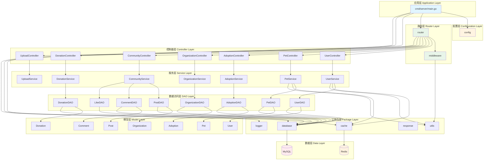

## 6. 前端包图 (Frontend Package Diagram)

```mermaid
graph TB
    subgraph "入口层 Entry Layer"
        Main[main.tsx]
        App[App.tsx]
    end

    subgraph "路由层 Router Layer"
        RouterConfig[router/index.tsx]
    end

    subgraph "布局组件 Layout Components"
        Layout[Layout]
        AdminLayout[AdminLayout]
        Header[Header]
        Footer[Footer]
    end

    subgraph "UI组件 UI Components"
        Button[Button]
        Card[Card]
        Input[Input]
        Dialog[Dialog]
        Select[Select]
        Toast[Toast]
    end

    subgraph "用户页面 User Pages"
        Home[Home]
        Login[Login]
        Register[Register]
        Profile[Profile]
    end

    subgraph "宠物页面 Pet Pages"
        PetList[PetList]
        PetDetail[PetDetail]
        CreatePet[CreatePet]
        MyPets[MyPets]
    end

    subgraph "领养页面 Adoption Pages"
        AdoptApply[AdoptApply]
        MyApplications[MyApplications]
    end

    subgraph "社区页面 Community Pages"
        Community[Community]
        PostDetail[PostDetail]
        CreatePost[CreatePost]
    end

    subgraph "捐赠页面 Donation Pages"
        Donate[Donate]
        MyDonations[MyDonations]
    end

    subgraph "机构页面 Organization Pages"
        OrgApply[OrganizationApply]
        MyOrgs[MyOrganizations]
    end

    subgraph "管理页面 Admin Pages"
        Dashboard[Dashboard]
        UserMgmt[UserManagement]
        PetMgmt[PetManagement]
        AdoptionMgmt[AdoptionManagement]
        OrgReview[OrganizationReview]
    end

    subgraph "工具库 Libraries"
        API[api.ts]
        AdminAPI[adminApi.ts]
        Utils[utils.ts]
    end

    subgraph "状态管理 State Management"
        AuthStore[auth.ts]
    end

    subgraph "后端API Backend API"
        Backend[Backend Server]
    end

    %% 依赖关系
    Main --> App
    Main --> RouterConfig
    App --> RouterConfig

    RouterConfig --> Layout
    RouterConfig --> AdminLayout

    Layout --> Header
    Layout --> Footer
    Layout --> Home
    Layout --> Login
    Layout --> Register
    Layout --> Profile
    Layout --> PetList
    Layout --> PetDetail
    Layout --> CreatePet
    Layout --> MyPets
    Layout --> AdoptApply
    Layout --> MyApplications
    Layout --> Community
    Layout --> PostDetail
    Layout --> CreatePost
    Layout --> Donate
    Layout --> MyDonations
    Layout --> OrgApply
    Layout --> MyOrgs

    AdminLayout --> Dashboard
    AdminLayout --> UserMgmt
    AdminLayout --> PetMgmt
    AdminLayout --> AdoptionMgmt
    AdminLayout --> OrgReview

    Home --> Button
    Home --> Card
    Login --> Input
    Login --> Button
    Register --> Input
    Register --> Button
    PetList --> Card
    PetDetail --> Button
    CreatePet --> Input
    CreatePet --> Select

    Home --> API
    Login --> API
    Register --> API
    Profile --> API
    PetList --> API
    PetDetail --> API
    CreatePet --> API
    MyPets --> API
    AdoptApply --> API
    MyApplications --> API
    Community --> API
    Donate --> API
    MyDonations --> API
    OrgApply --> API
    MyOrgs --> API

    Dashboard --> AdminAPI
    UserMgmt --> AdminAPI
    PetMgmt --> AdminAPI
    AdoptionMgmt --> AdminAPI
    OrgReview --> AdminAPI

    Login --> AuthStore
    Register --> AuthStore
    Profile --> AuthStore
    Header --> AuthStore

    API --> Backend
    AdminAPI --> Backend
    API --> Utils
    AdminAPI --> Utils

    style Main fill:#e1f5ff
    style App fill:#e1f5ff
    style RouterConfig fill:#fff4e1
    style Backend fill:#ffebee
    style AuthStore fill:#f3e5f5
```

## 7. 数据库ER图 (Entity Relationship Diagram)

```mermaid
erDiagram
    USERS ||--o{ PETS : publishes
    USERS ||--o{ ADOPTION_APPLICATIONS : submits
    USERS ||--o{ ADOPTIONS : adopts
    USERS ||--o{ ORGANIZATIONS : creates
    USERS ||--o{ POSTS : publishes
    USERS ||--o{ COMMENTS : writes
    USERS ||--o{ LIKES : likes
    USERS ||--o{ DONATIONS : donates

    PETS ||--o{ ADOPTION_APPLICATIONS : receives
    PETS ||--o{ ADOPTIONS : adopted_as
    
    ORGANIZATIONS ||--o{ PETS : manages
    ORGANIZATIONS ||--o{ ADOPTION_APPLICATIONS : reviews
    ORGANIZATIONS ||--o{ ADOPTIONS : facilitates
    ORGANIZATIONS ||--o{ DONATIONS : receives

    ADOPTION_APPLICATIONS ||--|| ADOPTIONS : becomes

    POSTS ||--o{ COMMENTS : has
    POSTS ||--o{ LIKES : receives
    COMMENTS ||--o{ LIKES : receives

    USERS {
        bigint id PK
        varchar username UK
        varchar password
        varchar real_name
        varchar phone UK
        varchar email UK
        varchar avatar
        tinyint gender
        date birthday
        varchar id_card
        text address
        enum role
        tinyint status
        timestamp last_login_at
        varchar last_login_ip
        timestamp created_at
        timestamp updated_at
        timestamp deleted_at
    }

    PETS {
        bigint id PK
        varchar name
        varchar type
        varchar breed
        varchar gender
        int age
        varchar size
        varchar color
        decimal weight
        boolean is_vaccinated
        boolean is_sterilized
        varchar health_status
        text description
        text character
        text photos
        varchar cover_photo
        varchar province
        varchar city
        varchar district
        varchar address
        bigint user_id FK
        tinyint status
        int view_count
        int favorite_count
        bigint adopted_by FK
        timestamp adopted_at
        bigint reviewed_by FK
        timestamp reviewed_at
        varchar reject_reason
        timestamp created_at
        timestamp updated_at
        timestamp deleted_at
    }

    ADOPTION_APPLICATIONS {
        bigint id PK
        varchar application_no UK
        bigint user_id FK
        bigint pet_id FK
        bigint organization_id FK
        varchar applicant_name
        varchar applicant_phone
        varchar applicant_id_card
        text applicant_address
        varchar housing_type
        int housing_area
        boolean has_yard
        int family_members
        boolean has_children
        varchar children_age
        boolean family_agree
        boolean has_pet_experience
        text pet_experience
        text current_pets
        text adoption_reason
        text how_to_care
        text emergency_plan
        varchar id_card_image
        varchar housing_proof
        text additional_files
        tinyint status
        bigint reviewer_id FK
        text review_comment
        timestamp interview_time
        timestamp home_visit_time
        timestamp approved_at
        timestamp rejected_at
        text rejection_reason
        timestamp created_at
        timestamp updated_at
        timestamp deleted_at
    }

    ADOPTIONS {
        bigint id PK
        bigint application_id FK UK
        bigint user_id FK
        bigint pet_id FK
        bigint organization_id FK
        date adoption_date
        varchar handover_location
        varchar agreement_url
        boolean agreement_signed
        text follow_up_plan
        varchar status
        text notes
        timestamp created_at
        timestamp updated_at
        timestamp deleted_at
    }

    ORGANIZATIONS {
        bigint id PK
        varchar name
        varchar type
        varchar logo
        text description
        varchar province
        varchar city
        varchar address
        varchar contact_name
        varchar contact_phone
        varchar contact_email
        varchar phone
        varchar email
        json credential_urls
        tinyint status
        varchar reject_reason
        bigint created_by FK
        bigint updated_by FK
        timestamp created_at
        timestamp updated_at
        timestamp deleted_at
    }

    POSTS {
        bigint id PK
        bigint user_id FK
        varchar title
        text content
        text images
        varchar category
        int view_count
        int like_count
        int comment_count
        tinyint status
        timestamp created_at
        timestamp updated_at
        timestamp deleted_at
    }

    COMMENTS {
        bigint id PK
        bigint post_id FK
        bigint user_id FK
        bigint parent_id FK
        text content
        int like_count
        timestamp created_at
        timestamp updated_at
        timestamp deleted_at
    }

    LIKES {
        bigint id PK
        bigint user_id FK
        varchar target_type
        bigint target_id
        timestamp created_at
    }

    DONATIONS {
        bigint id PK
        varchar donation_no UK
        bigint user_id FK
        bigint organization_id FK
        decimal amount
        varchar payment_method
        varchar donor_name
        varchar donor_phone
        text message
        boolean is_anonymous
        varchar status
        timestamp paid_at
        timestamp confirmed_at
        timestamp created_at
        timestamp updated_at
        timestamp deleted_at
    }
```


## 8. 后端类图 (Backend Class Diagram)

### 8.1 用户模块类图

```mermaid
classDiagram
    class User {
        +int64 ID
        +string Username
        +string Password
        +string RealName
        +string Phone
        +string Email
        +string Avatar
        +Gender Gender
        +time.Time Birthday
        +string IDCard
        +string Address
        +UserRole Role
        +UserStatus Status
        +time.Time LastLoginAt
        +string LastLoginIP
        +time.Time CreatedAt
        +time.Time UpdatedAt
        +time.Time DeletedAt
        +IsAdmin() bool
        +IsOrganization() bool
        +IsActive() bool
        +MaskSensitiveInfo() User
        +ToUserInfo() UserInfo
    }

    class UserRole {
        <<enumeration>>
        user
        organization
        volunteer
        admin
    }

    class UserStatus {
        <<enumeration>>
        Disabled
        Normal
    }

    class UserController {
        -db *gorm.DB
        -rdb *redis.Client
        +Register(c *gin.Context)
        +Login(c *gin.Context)
        +GetProfile(c *gin.Context)
        +UpdateProfile(c *gin.Context)
        +UpdatePassword(c *gin.Context)
        +GetUserList(c *gin.Context)
        +SearchUsers(c *gin.Context)
        +GetUserByID(c *gin.Context)
        +DisableUser(c *gin.Context)
        +EnableUser(c *gin.Context)
    }

    class UserService {
        -dao *UserDAO
        -cache *redis.Client
        +Register(req UserRegisterRequest) error
        +Login(req UserLoginRequest) (UserLoginResponse, error)
        +GetProfile(userID int64) (User, error)
        +UpdateProfile(userID int64, req UserUpdateRequest) error
        +UpdatePassword(userID int64, req UpdatePasswordRequest) error
        +GetUserList(page, pageSize int) ([]User, int64, error)
        +SearchUsers(keyword string) ([]User, error)
        +DisableUser(userID int64) error
        +EnableUser(userID int64) error
    }

    class UserDAO {
        -db *gorm.DB
        +Create(user *User) error
        +GetByID(id int64) (User, error)
        +GetByUsername(username string) (User, error)
        +GetByPhone(phone string) (User, error)
        +GetByEmail(email string) (User, error)
        +Update(user *User) error
        +Delete(id int64) error
        +List(page, pageSize int) ([]User, int64, error)
        +Search(keyword string) ([]User, error)
        +UpdateStatus(id int64, status UserStatus) error
    }

    UserController --> UserService : uses
    UserService --> UserDAO : uses
    UserDAO --> User : manages
    User --> UserRole : has
    User --> UserStatus : has
```

### 8.2 宠物模块类图

```mermaid
classDiagram
    class Pet {
        +uint64 ID
        +string Name
        +PetType Type
        +string Breed
        +PetGender Gender
        +int Age
        +PetSize Size
        +string Color
        +float64 Weight
        +bool IsVaccinated
        +bool IsSterilized
        +string HealthStatus
        +string Description
        +string Character
        +string Photos
        +string CoverPhoto
        +string Province
        +string City
        +string District
        +string Address
        +int64 UserID
        +PetStatus Status
        +int ViewCount
        +int FavoriteCount
        +int64 AdoptedBy
        +time.Time AdoptedAt
        +int64 ReviewedBy
        +time.Time ReviewedAt
        +string RejectReason
        +time.Time CreatedAt
        +time.Time UpdatedAt
        +time.Time DeletedAt
    }

    class PetType {
        <<enumeration>>
        dog
        cat
        rabbit
        bird
        other
    }

    class PetGender {
        <<enumeration>>
        male
        female
        unknown
    }

    class PetStatus {
        <<enumeration>>
        Pending
        Available
        Adopted
        Offline
        +String() string
        +MarshalJSON() ([]byte, error)
        +Scan(value interface{}) error
        +Value() (driver.Value, error)
    }

    class PetSize {
        <<enumeration>>
        small
        medium
        large
    }

    class PetController {
        -db *gorm.DB
        -rdb *redis.Client
        +ListPets(c *gin.Context)
        +QueryPets(c *gin.Context)
        +SearchPets(c *gin.Context)
        +GetRecommendedPets(c *gin.Context)
        +GetStatistics(c *gin.Context)
        +GetPetDetail(c *gin.Context)
        +CreatePet(c *gin.Context)
        +GetMyPets(c *gin.Context)
        +UpdatePet(c *gin.Context)
        +DeletePet(c *gin.Context)
        +OfflinePet(c *gin.Context)
        +GetPendingPets(c *gin.Context)
        +ApprovePet(c *gin.Context)
        +RejectPet(c *gin.Context)
        +AdminUpdatePet(c *gin.Context)
    }

    class PetService {
        -dao *PetDAO
        -cache *redis.Client
        +Create(pet *Pet) error
        +GetByID(id uint64) (Pet, error)
        +List(query PetQueryRequest) ([]Pet, int64, error)
        +Search(keyword string) ([]Pet, error)
        +GetRecommended(limit int) ([]Pet, error)
        +GetMyPets(userID int64) ([]Pet, error)
        +Update(pet *Pet) error
        +Delete(id uint64) error
        +UpdateStatus(id uint64, status PetStatus) error
        +IncrementViewCount(id uint64) error
        +GetStatistics() (map[string]interface{}, error)
    }

    class PetDAO {
        -db *gorm.DB
        +Create(pet *Pet) error
        +GetByID(id uint64) (Pet, error)
        +List(query PetQueryRequest) ([]Pet, int64, error)
        +Search(keyword string) ([]Pet, error)
        +GetByUserID(userID int64) ([]Pet, error)
        +Update(pet *Pet) error
        +Delete(id uint64) error
        +UpdateStatus(id uint64, status PetStatus) error
        +IncrementViewCount(id uint64) error
        +GetStatistics() (map[string]interface{}, error)
    }

    PetController --> PetService : uses
    PetService --> PetDAO : uses
    PetDAO --> Pet : manages
    Pet --> PetType : has
    Pet --> PetGender : has
    Pet --> PetStatus : has
    Pet --> PetSize : has
```

### 8.3 领养模块类图

```mermaid
classDiagram
    class AdoptionApplication {
        +uint64 ID
        +string ApplicationNo
        +int64 UserID
        +uint64 PetID
        +uint64 OrganizationID
        +string ApplicantName
        +string ApplicantPhone
        +string ApplicantIDCard
        +string ApplicantAddress
        +HousingType HousingType
        +int HousingArea
        +bool HasYard
        +int FamilyMembers
        +bool HasChildren
        +string ChildrenAge
        +bool FamilyAgree
        +bool HasPetExperience
        +string PetExperience
        +string CurrentPets
        +string AdoptionReason
        +string HowToCare
        +string EmergencyPlan
        +string IDCardImage
        +string HousingProof
        +string AdditionalFiles
        +ApplicationStatus Status
        +int64 ReviewerID
        +string ReviewComment
        +time.Time InterviewTime
        +time.Time HomeVisitTime
        +time.Time ApprovedAt
        +time.Time RejectedAt
        +string RejectionReason
        +time.Time CreatedAt
        +time.Time UpdatedAt
        +time.Time DeletedAt
    }

    class ApplicationStatus {
        <<enumeration>>
        Pending
        Reviewing
        Interview
        HomeVisit
        Approved
        Rejected
        Cancelled
        +String() string
        +MarshalJSON() ([]byte, error)
        +Scan(value interface{}) error
        +Value() (driver.Value, error)
    }

    class HousingType {
        <<enumeration>>
        apartment
        house
        villa
        other
    }

    class Adoption {
        +uint64 ID
        +uint64 ApplicationID
        +int64 UserID
        +uint64 PetID
        +uint64 OrganizationID
        +time.Time AdoptionDate
        +string HandoverLocation
        +string AgreementURL
        +bool AgreementSigned
        +string FollowUpPlan
        +AdoptionStatus Status
        +string Notes
        +time.Time CreatedAt
        +time.Time UpdatedAt
        +time.Time DeletedAt
    }

    class AdoptionStatus {
        <<enumeration>>
        active
        returned
        deceased
    }

    class AdoptionController {
        -db *gorm.DB
        +CreateApplication(c *gin.Context)
        +GetMyApplications(c *gin.Context)
        +GetApplicationByID(c *gin.Context)
        +UpdateApplication(c *gin.Context)
        +CancelApplication(c *gin.Context)
        +GetMyAdoptions(c *gin.Context)
        +GetAdoptionByID(c *gin.Context)
        +ListApplications(c *gin.Context)
        +GetPendingApplications(c *gin.Context)
        +QueryApplications(c *gin.Context)
        +ReviewApplication(c *gin.Context)
        +CreateAdoption(c *gin.Context)
        +ListAdoptions(c *gin.Context)
        +UpdateAdoptionStatus(c *gin.Context)
        +GetStatistics(c *gin.Context)
    }

    class AdoptionService {
        -applicationDAO *AdoptionDAO
        -adoptionDAO *AdoptionDAO
        +CreateApplication(req ApplicationCreateRequest) error
        +GetApplicationByID(id uint64) (AdoptionApplication, error)
        +GetMyApplications(userID int64) ([]AdoptionApplication, error)
        +UpdateApplication(id uint64, req ApplicationUpdateRequest) error
        +CancelApplication(id uint64) error
        +ReviewApplication(id uint64, req ApplicationReviewRequest) error
        +CreateAdoption(req AdoptionCreateRequest) error
        +GetAdoptionByID(id uint64) (Adoption, error)
        +GetMyAdoptions(userID int64) ([]Adoption, error)
        +UpdateAdoptionStatus(id uint64, status AdoptionStatus) error
        +GetStatistics() (map[string]interface{}, error)
    }

    class AdoptionDAO {
        -db *gorm.DB
        +CreateApplication(app *AdoptionApplication) error
        +GetApplicationByID(id uint64) (AdoptionApplication, error)
        +GetApplicationsByUserID(userID int64) ([]AdoptionApplication, error)
        +UpdateApplication(app *AdoptionApplication) error
        +DeleteApplication(id uint64) error
        +ListApplications(query ApplicationQueryRequest) ([]AdoptionApplication, int64, error)
        +CreateAdoption(adoption *Adoption) error
        +GetAdoptionByID(id uint64) (Adoption, error)
        +GetAdoptionsByUserID(userID int64) ([]Adoption, error)
        +UpdateAdoption(adoption *Adoption) error
        +GetStatistics() (map[string]interface{}, error)
    }

    AdoptionController --> AdoptionService : uses
    AdoptionService --> AdoptionDAO : uses
    AdoptionDAO --> AdoptionApplication : manages
    AdoptionDAO --> Adoption : manages
    AdoptionApplication --> ApplicationStatus : has
    AdoptionApplication --> HousingType : has
    Adoption --> AdoptionStatus : has
    Adoption --> AdoptionApplication : references
```

### 8.4 机构模块类图

```mermaid
classDiagram
    class Organization {
        +uint64 ID
        +string Name
        +string Type
        +string Logo
        +string Description
        +string Province
        +string City
        +string Address
        +string ContactName
        +string ContactPhone
        +string ContactEmail
        +string Phone
        +string Email
        +[]string CredentialUrls
        +OrganizationStatus Status
        +string RejectReason
        +uint64 CreatedBy
        +uint64 UpdatedBy
        +time.Time CreatedAt
        +time.Time UpdatedAt
        +time.Time DeletedAt
        +ToOrganizationInfo() OrganizationInfo
    }

    class OrganizationStatus {
        <<enumeration>>
        Pending
        Approved
        Rejected
        +String() string
        +MarshalJSON() ([]byte, error)
        +Scan(value interface{}) error
        +Value() (driver.Value, error)
    }

    class OrganizationController {
        -db *gorm.DB
        +ListOrganizations(c *gin.Context)
        +GetOrganization(c *gin.Context)
        +RegisterOrganization(c *gin.Context)
        +CreateOrganization(c *gin.Context)
        +GetMyOrganizations(c *gin.Context)
        +UpdateOrganization(c *gin.Context)
        +DeleteOrganization(c *gin.Context)
        +UpdateOrganizationStatus(c *gin.Context)
    }

    class OrganizationService {
        -dao *OrganizationDAO
        +Create(org *Organization) error
        +GetByID(id uint64) (Organization, error)
        +List(page, pageSize int) ([]Organization, int64, error)
        +GetMyOrganizations(userID uint64) ([]Organization, error)
        +Update(org *Organization) error
        +Delete(id uint64) error
        +UpdateStatus(id uint64, status OrganizationStatus, reason string) error
    }

    class OrganizationDAO {
        -db *gorm.DB
        +Create(org *Organization) error
        +GetByID(id uint64) (Organization, error)
        +List(page, pageSize int) ([]Organization, int64, error)
        +GetByCreatedBy(userID uint64) ([]Organization, error)
        +Update(org *Organization) error
        +Delete(id uint64) error
        +UpdateStatus(id uint64, status OrganizationStatus, reason string) error
    }

    OrganizationController --> OrganizationService : uses
    OrganizationService --> OrganizationDAO : uses
    OrganizationDAO --> Organization : manages
    Organization --> OrganizationStatus : has
```

### 8.5 社区模块类图

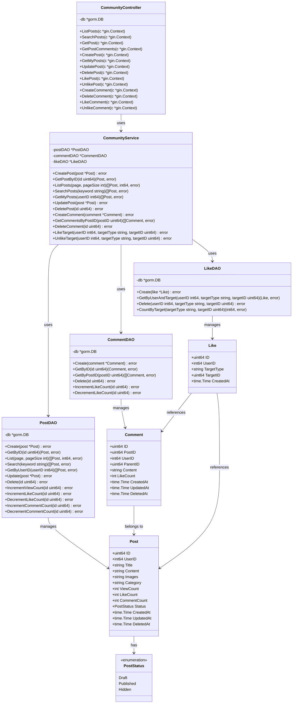

### 8.6 捐赠模块类图

```mermaid
classDiagram
    class Donation {
        +uint64 ID
        +string DonationNo
        +int64 UserID
        +uint64 OrganizationID
        +decimal Amount
        +string PaymentMethod
        +string DonorName
        +string DonorPhone
        +string Message
        +bool IsAnonymous
        +DonationStatus Status
        +time.Time PaidAt
        +time.Time ConfirmedAt
        +time.Time CreatedAt
        +time.Time UpdatedAt
        +time.Time DeletedAt
    }

    class DonationStatus {
        <<enumeration>>
        pending
        paid
        confirmed
        cancelled
    }

    class DonationController {
        -db *gorm.DB
        +GetPublicDonations(c *gin.Context)
        +GetStatistics(c *gin.Context)
        +CreateDonation(c *gin.Context)
        +GetMyDonations(c *gin.Context)
        +GetDonation(c *gin.Context)
        +ConfirmDonation(c *gin.Context)
        +CancelDonation(c *gin.Context)
        +ListDonations(c *gin.Context)
        +CompleteDonation(c *gin.Context)
    }

    class DonationService {
        -dao *DonationDAO
        +Create(donation *Donation) error
        +GetByID(id uint64) (Donation, error)
        +GetMyDonations(userID int64) ([]Donation, error)
        +GetPublicDonations(limit int) ([]Donation, error)
        +ConfirmDonation(id uint64) error
        +CancelDonation(id uint64) error
        +CompleteDonation(id uint64) error
        +GetStatistics() (map[string]interface{}, error)
    }

    class DonationDAO {
        -db *gorm.DB
        +Create(donation *Donation) error
        +GetByID(id uint64) (Donation, error)
        +GetByUserID(userID int64) ([]Donation, error)
        +GetPublicDonations(limit int) ([]Donation, error)
        +Update(donation *Donation) error
        +Delete(id uint64) error
        +GetStatistics() (map[string]interface{}, error)
    }

    DonationController --> DonationService : uses
    DonationService --> DonationDAO : uses
    DonationDAO --> Donation : manages
    Donation --> DonationStatus : has
```


## 9. 前端类图 (Frontend Class Diagram)

### 9.1 状态管理类图

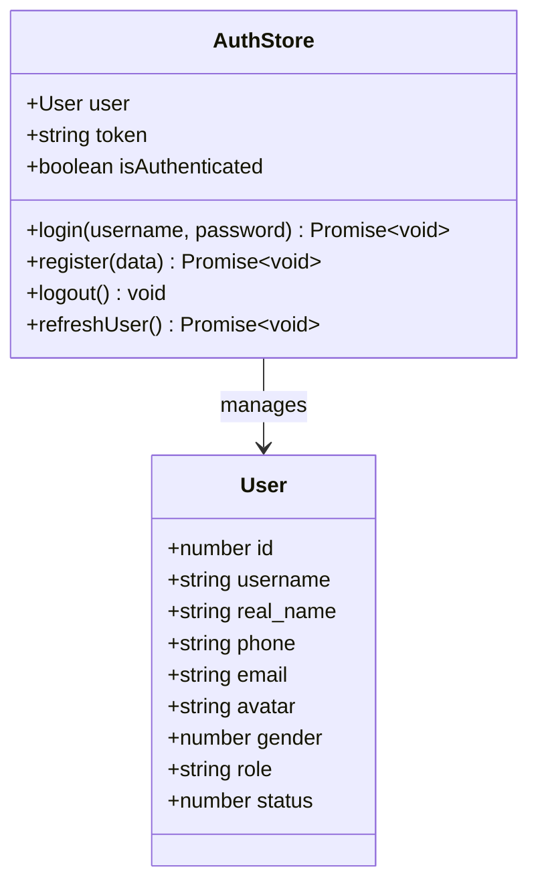

### 9.2 API客户端类图

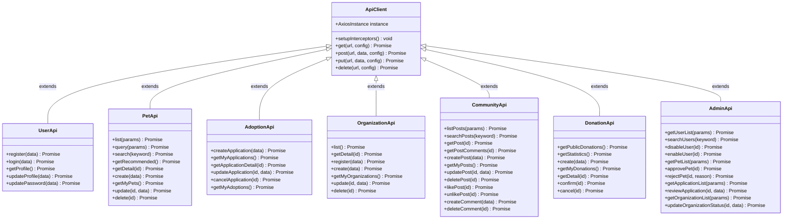

### 9.3 页面组件类图

```mermaid
classDiagram
    class Layout {
        +ReactNode children
        +render() JSX.Element
    }

    class Header {
        +User user
        +boolean isAuthenticated
        +handleLogout() void
        +render() JSX.Element
    }

    class Footer {
        +render() JSX.Element
    }

    class Home {
        +Pet[] recommendedPets
        +Statistics stats
        +useEffect() void
        +render() JSX.Element
    }

    class PetList {
        +Pet[] pets
        +PetQueryParams filters
        +number page
        +number total
        +handleFilterChange() void
        +handlePageChange() void
        +render() JSX.Element
    }

    class PetDetail {
        +Pet pet
        +number petId
        +useEffect() void
        +handleAdopt() void
        +render() JSX.Element
    }

    class CreatePet {
        +PetFormData formData
        +string[] photos
        +handleSubmit() void
        +handlePhotoUpload() void
        +render() JSX.Element
    }

    class AdoptApply {
        +Pet pet
        +ApplicationFormData formData
        +handleSubmit() void
        +render() JSX.Element
    }

    class MyApplications {
        +Application[] applications
        +useEffect() void
        +handleCancel(id) void
        +render() JSX.Element
    }

    class Community {
        +Post[] posts
        +number page
        +handleLike(id) void
        +render() JSX.Element
    }

    class Donate {
        +Organization[] organizations
        +DonationFormData formData
        +handleSubmit() void
        +render() JSX.Element
    }

    class AdminDashboard {
        +Statistics stats
        +useEffect() void
        +render() JSX.Element
    }

    class UserManagement {
        +User[] users
        +handleDisable(id) void
        +handleEnable(id) void
        +render() JSX.Element
    }

    class PetManagement {
        +Pet[] pets
        +handleApprove(id) void
        +handleReject(id) void
        +render() JSX.Element
    }

    Layout --> Header : contains
    Layout --> Footer : contains
    Layout --> Home : renders
    Layout --> PetList : renders
    Layout --> PetDetail : renders
    Layout --> CreatePet : renders
    Layout --> AdoptApply : renders
    Layout --> MyApplications : renders
    Layout --> Community : renders
    Layout --> Donate : renders
```

## 10. 中间件类图

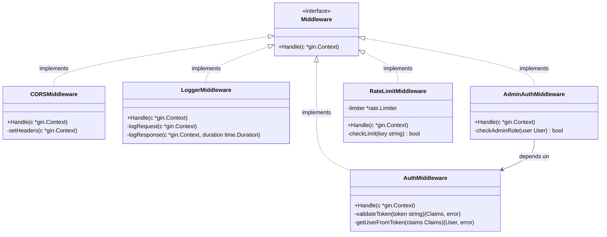

## 11. 公共包类图

```mermaid
classDiagram
    class Database {
        +*gorm.DB DB
        +Init(config Config) error
        +Close() error
        +AutoMigrate(models ...interface{}) error
    }

    class Cache {
        +*redis.Client Client
        +Init(config Config) error
        +Close() error
        +Set(key string, value interface{}, expiration time.Duration) error
        +Get(key string) (string, error)
        +Del(keys ...string) error
        +Exists(keys ...string) (int64, error)
    }

    class Logger {
        +*zap.Logger Logger
        +Init(config Config) error
        +Debug(msg string, fields ...zap.Field)
        +Info(msg string, fields ...zap.Field)
        +Warn(msg string, fields ...zap.Field)
        +Error(msg string, fields ...zap.Field)
        +Fatal(msg string, fields ...zap.Field)
    }

    class Response {
        +Success(c *gin.Context, data interface{})
        +Error(c *gin.Context, code int, message string)
        +SuccessWithMessage(c *gin.Context, message string, data interface{})
        +Pagination(c *gin.Context, data interface{}, total int64, page int, pageSize int)
    }

    class JWTUtils {
        +GenerateToken(userID int64, username string, role string) (string, error)
        +ParseToken(tokenString string) (*Claims, error)
        +RefreshToken(tokenString string) (string, error)
    }

    class BCryptUtils {
        +HashPassword(password string) (string, error)
        +CheckPassword(password string, hash string) bool
    }

    class StringUtils {
        +RandomString(length int) string
        +GenerateCode(length int) string
        +MaskPhone(phone string) string
        +MaskEmail(email string) string
    }

    class TimeUtils {
        +FormatTime(t time.Time) string
        +ParseTime(str string) (time.Time, error)
        +GetStartOfDay(t time.Time) time.Time
        +GetEndOfDay(t time.Time) time.Time
    }
```

## 12. 数据流图 (Data Flow Diagram)

### 12.1 用户登录流程

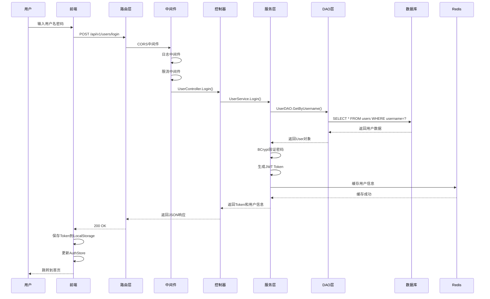

### 12.2 宠物发布流程

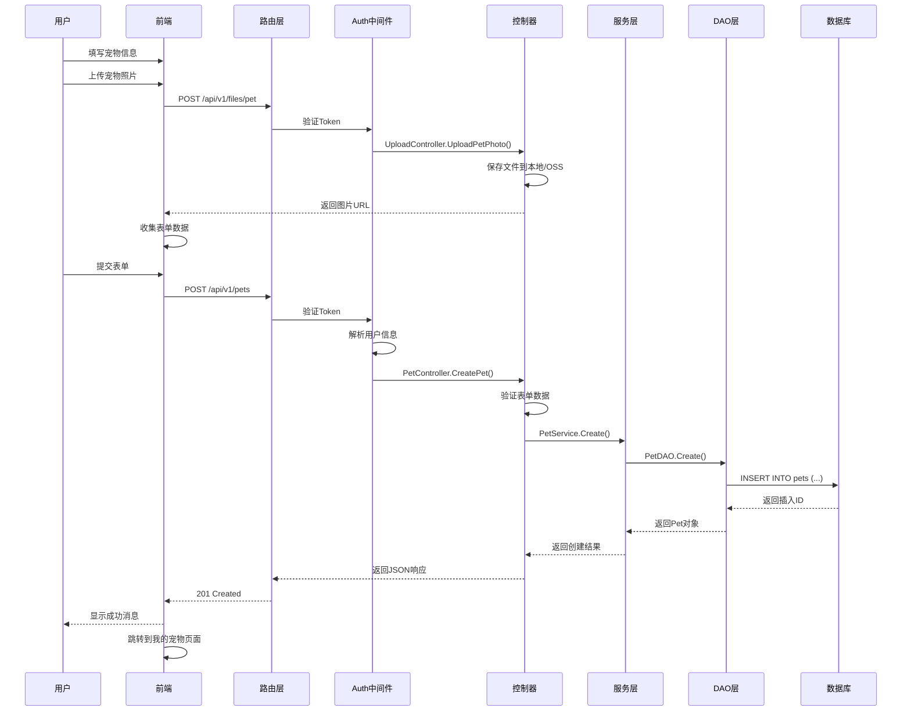

### 12.3 领养申请流程

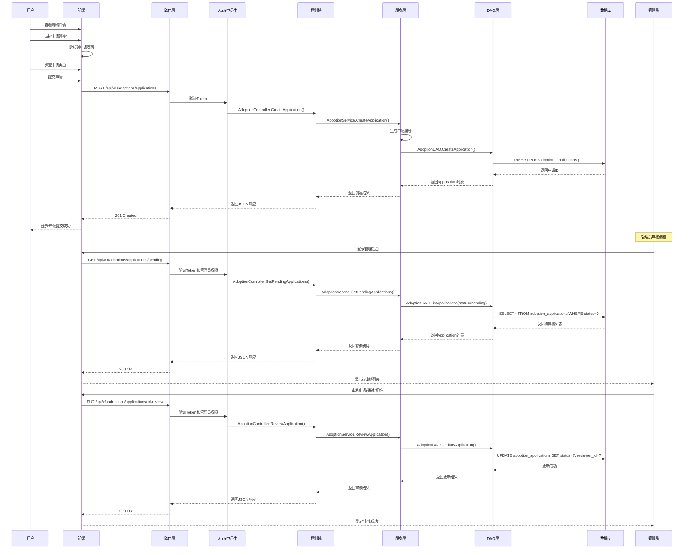

## 13. 部署架构图

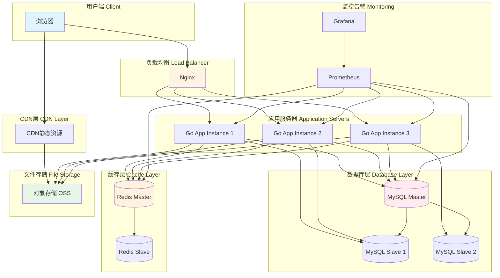

## 14. 技术栈总结

### 14.1 后端技术栈

| 类别 | 技术 | 版本 | 用途 |
|------|------|------|------|
| 语言 | Go | 1.25+ | 主要开发语言 |
| Web框架 | Gin | 1.11+ | HTTP服务框架 |
| ORM | GORM | 1.31+ | 数据库ORM |
| 数据库 | MySQL | 8.0+ | 关系型数据库 |
| 缓存 | Redis | 7.0+ | 缓存和会话存储 |
| 日志 | Zap | 1.27+ | 高性能日志库 |
| 配置 | Viper | 1.21+ | 配置管理 |
| 认证 | JWT | 5.3+ | Token认证 |
| 加密 | BCrypt | - | 密码加密 |
| 容器 | Docker | - | 容器化部署 |

### 14.2 前端技术栈

| 类别 | 技术 | 版本 | 用途 |
|------|------|------|------|
| 语言 | TypeScript | 5.6+ | 主要开发语言 |
| 框架 | React | 18.3+ | UI框架 |
| 构建工具 | Vite | 6.0+ | 开发和构建工具 |
| 路由 | React Router | 6.28+ | 前端路由 |
| 状态管理 | Zustand | 5.0+ | 轻量级状态管理 |
| 数据请求 | TanStack Query | 5.60+ | 数据获取和缓存 |
| HTTP客户端 | Axios | 1.7+ | HTTP请求库 |
| UI组件 | shadcn/ui | - | UI组件库 |
| CSS框架 | TailwindCSS | 3.4+ | 原子化CSS |
| 图标 | Lucide React | 0.460+ | 图标库 |
| 日期处理 | date-fns | 4.1+ | 日期工具库 |

### 14.3 开发工具

| 类别 | 工具 | 用途 |
|------|------|------|
| 版本控制 | Git | 代码版本管理 |
| 代码托管 | Gitee | 代码仓库 |
| API测试 | Apifox | API测试和文档 |
| 容器编排 | Docker Compose | 本地开发环境 |
| 反向代理 | Nginx | 生产环境代理 |
| 包管理 | Go Modules | Go依赖管理 |
| 包管理 | npm | Node依赖管理 |

---

**文档版本**: v1.0  
**创建日期**: 2025-12-17  
**最后更新**: 2025-12-17

